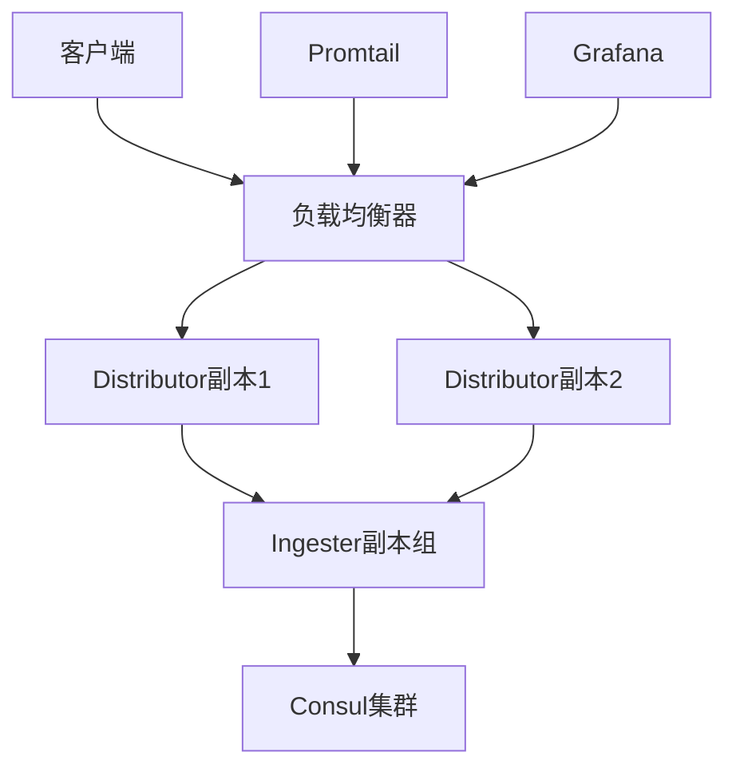

# Loki 高可用部署

## 介绍

高可用性（High Availability, HA）是生产环境部署的核心要求。Grafana Loki的高可用部署通过冗余关键组件和设计容错机制，确保日志系统在部分节点故障时仍能持续服务。本指南将介绍Loki高可用架构的核心原则和实现方法。

## 高可用架构设计

Loki的高可用部署通常采用"微服务模式"，将组件拆分为独立可扩展的单元：



关键组件说明：
- **Distributor**：无状态组件，可水平扩展
- **Ingester**：有状态组件，需配置副本和持久化存储
- **Consul**：服务发现和环哈希一致性维护

## 部署步骤

### 1. 配置分布式存储
Loki需要共享存储来实现Ingester故障转移：

```yaml
# loki-config.yaml
schema_config:
  configs:
    - from: 2020-10-24
      store: boltdb-shipper
      object_store: s3
      schema: v11
      index:
        prefix: index_
        period: 24h

storage_config:
  aws:
    s3: s3://access-key:secret-key@region/bucket-name
  boltdb_shipper:
    active_index_directory: /var/loki/boltdb-shipper-active
    cache_location: /var/loki/boltdb-shipper-cache
```

:::tip
生产环境推荐使用S3、GCS或Azure Blob Storage等云存储，或部署MinIO实现自托管的S3兼容存储
:::

### 2. 部署Ingester副本组
配置3个Ingester实例形成副本组：

```yaml
ingester:
  lifecycler:
    ring:
      kvstore:
        store: consul
        consul:
          host: consul:8500
      replication_factor: 3
    num_tokens: 128
    heartbeat_timeout: 1m
```

### 3. 配置Distributor负载均衡
使用Nginx实现Distributor层的负载均衡：

```nginx
upstream loki-distributors {
    server distributor1:3100;
    server distributor2:3100;
    server distributor3:3100;
}

server {
    listen 3100;
    location / {
        proxy_pass http://loki-distributors;
    }
}
```

## 实际案例：电商平台日志系统

**场景需求**：
- 每天处理10TB日志数据
- 99.9%可用性SLA
- 区域故障自动恢复

**解决方案**：
1. 跨3个可用区部署Loki集群
2. 每个区域部署完整组件：
   - 3 Distributors
   - 3 Ingesters（复制因子3）
   - 共享S3存储
3. 使用Consul实现全局服务发现

## 故障恢复测试

验证高可用性的典型测试场景：

1. 随机终止一个Ingester实例
   ```bash
   docker stop loki-ingester-2
   ```
2. 观察日志写入是否中断（应无中断）
3. 检查新实例是否自动加入环
   ```bash
   curl consul:8500/v1/catalog/service/loki-ingester
   ```

## 总结

Loki的高可用部署关键在于：
- 无状态组件水平扩展
- 有状态组件配置适当复制因子
- 可靠的共享存储后端
- 健全的服务发现机制

## 延伸学习

1. [Loki官方文档 - 生产建议](https://grafana.com/docs/loki/latest/installation/production/)
2. 练习：在本地使用Docker Compose搭建3节点Loki集群
3. 进阶：研究Loki的多租户隔离策略

:::caution
测试环境与生产环境的性能特征可能差异很大，建议进行压力测试后再上线
:::