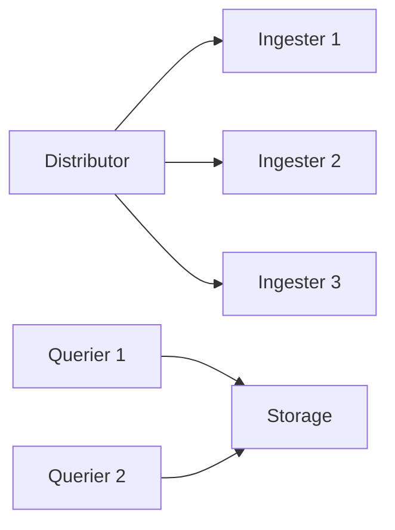

# Loki 水平扩展

## 介绍

水平扩展（Horizontal Scaling）是通过增加更多节点来分散系统负载的能力。对于Grafana Loki这样的日志聚合系统，水平扩展能显著提升日志摄入、存储和查询的性能。与垂直扩展（增加单个节点的资源）不同，水平扩展通过分布式架构实现弹性增长，更适合云原生环境。

:::note 关键概念
- **读写分离**：Loki将写入（Ingester）和读取（Querier）组件分离，各自独立扩展。
- **分片（Sharding）**：日志流被分散到多个Ingester节点处理。
- **一致性哈希**：确保相同日志流的请求始终路由到同一Ingester。
:::

---

## Loki 的扩展组件

Loki的微服务架构中，以下组件支持水平扩展：

1. **Distributor**：接收日志并路由到Ingester，可多实例部署。
2. **Ingester**：处理日志写入，通过分片扩展写入吞吐量。
3. **Querier**：执行查询，增加实例提升查询并发能力。
4. **Query Frontend**：可选组件，加速查询并行化。



---

## 配置水平扩展

### 1. 扩展Ingester

在Loki配置文件中（通常为`loki-config.yaml`），通过`-target=ingester`启动多个实例，并配置分片：

```yaml
ingester:
  lifecycler:
    ring:
      kvstore:
        store: memberlist  # 使用memberlist进行节点发现
      replication_factor: 3  # 每个日志流的副本数
```

启动命令示例：
```bash
loki -target=ingester -config.file=loki-config.yaml
```

:::warning 注意
确保`replication_factor`不超过Ingester实例数，否则写入会失败。
:::

### 2. 扩展Querier

增加Querier实例以分担查询负载：
```bash
loki -target=querier -config.file=loki-config.yaml
```

### 3. 使用Query Frontend

启用查询前端以并行化大查询：
```yaml
query_frontend:
  parallelise_shardable_queries: true
```

---

## 实际案例：电商日志处理

**场景**：一个电商平台在促销期间日志量增长10倍，需快速扩展Loki。

1. **初始状态**：3个Ingester，每秒处理10万日志行。
2. **扩展操作**：
   - 新增3个Ingester，共6个节点。
   - 调整`replication_factor`为3（保持高可用）。
3. **结果**：吞吐量提升至每秒20万日志行，无单点故障。

---

## 总结

水平扩展是Loki应对高负载的核心能力，关键步骤包括：
- 根据负载分离扩展读写组件。
- 合理配置分片和副本。
- 监控性能指标（如`loki_ingester_samples_per_second`）指导扩展决策。

**附加练习**：
1. 在本地使用Docker Compose部署多节点Loki集群。
2. 使用`k6`工具模拟高负载，观察扩展效果。

**延伸阅读**：
- [Loki官方文档：水平扩展](https://grafana.com/docs/loki/latest/scaling/)
- 《云原生日志系统设计模式》（推荐章节：分片与复制）