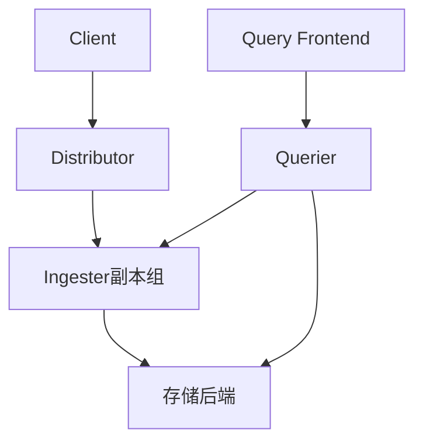
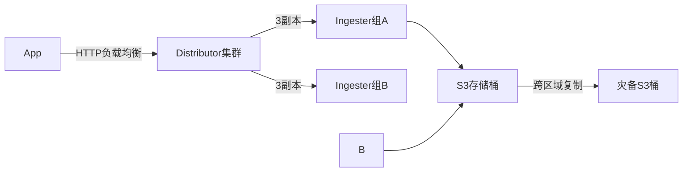

# Loki 高可用概述

## 什么是高可用性？

高可用性（High Availability, HA）指系统能够在预定的时间内持续提供服务的能力，通常通过冗余设计和故障自动转移来实现。对于日志系统而言，高可用意味着即使部分节点故障，仍能保证日志的持续采集、存储和查询。

在Loki中，高可用性通过以下核心机制实现：
- **无状态组件横向扩展**（如Distributor/Query Frontend）
- **有状态组件的复制**（如Ingester的副本集）
- **分布式存储后端**（如S3/GCS/Cassandra）
- **服务发现与健康检查**

## Loki 的高可用架构



关键组件说明：

1. **Distributor**  
   负责接收日志数据并通过一致性哈希将其分发到Ingester节点。支持多副本同时写入：
   ```go
   // 示例：Loki客户端配置多Distributor地址
   clients:
     - url: http://distributor1:3100/loki/api/v1/push
     - url: http://distributor2:3100/loki/api/v1/push
   ```

2. **Ingester**  
   采用"Primary/Secondary"模式，每个日志流会写入多个Ingester节点（通常配置`replication_factor: 3`）：
   ```yaml
   # loki-config.yaml片段
   ingester:
     lifecycler:
       replication_factor: 3
       ring:
         kvstore:
           store: consul
   ```

3. **存储后端**  
   对象存储（如S3）本身提供高可用，Loki会为每个块(Chunk)生成唯一标识：
   ```
   /tenant_id/chunks/000001/chunk_1234567890_abcdef.meta
   ```

## 实际案例：电商平台日志系统

**场景需求**：
- 日均日志量 10TB
- 查询响应时间 < 2秒
- 全年可用性 99.95%

**解决方案**：


配置要点：
```yaml
limits_config:
  ingestion_rate_mb: 50
  max_streams_per_user: 100000
ingester:
  chunk_block_size: 262144  # 256KB
  chunk_retain_period: 5m
```

## 故障恢复流程

当检测到Ingester节点故障时（通过心跳超时）：

1. 环(Ring)状态更新（通过Consul等KV存储）
2. 其他副本节点接管故障节点的流量
3. 恢复后通过WAL(Write-Ahead Log)同步数据

:::tip 最佳实践
- 至少部署3个Ingester副本
- 为Distributor配置负载均衡
- 监控`loki_ingester_flush_failures_total`指标
:::

## 总结

Loki通过以下设计实现高可用：
- 无状态组件的水平扩展
- 有状态组件的多副本机制
- 最终一致性的存储模型
- 自动化的故障检测与恢复

**延伸学习**：
- [Loki官方文档 - 运维指南](https://grafana.com/docs/loki/latest/operations/)
- 使用`k6`进行Loki压力测试
- 通过Grafana监控`loki_*`相关指标
``` 

注意：实际使用时请移除最外层的