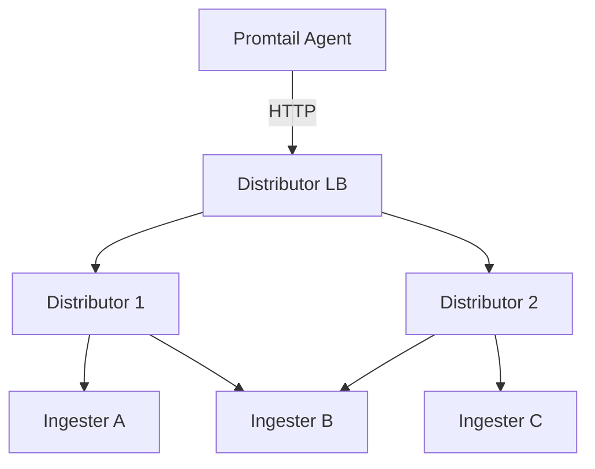

# 组件冗余部署

## 介绍

在分布式系统中，**组件冗余部署**是保障高可用性的核心策略之一。它通过为关键组件部署多个实例，避免单点故障导致的服务中断。对于Grafana Loki这样的日志聚合系统，冗余部署能够确保即使部分节点失效，日志的采集、存储和查询仍能正常进行。

:::tip 冗余 vs 备份
冗余是**同时运行多个实例**以分担负载和容错，而备份是**数据或配置的副本**，用于灾难恢复。两者通常结合使用。
:::

## 为什么需要冗余部署？

1. **容错能力**：单个节点故障时，其他节点可接管请求。<br />
2. **负载均衡**：多个实例共同分担流量，避免性能瓶颈。<br />
3. **零停机升级**：可轮流升级实例而不影响服务。

## Loki 的关键冗余组件

Loki 的主要组件及其冗余部署方式：

| 组件           | 冗余策略                     | 工具示例                |
|----------------|----------------------------|------------------------|
| Ingester       | 多实例 + 副本因子（`-ingester.replication-factor`） | Kubernetes Deployment  |
| Distributor    | 多实例 + 负载均衡            | Nginx/HAProxy          |
| Querier        | 多实例 + 无状态横向扩展       | Kubernetes ReplicaSet  |
| Object Storage | 原生支持多副本（如S3、GCS）   | AWS S3, Google Cloud Storage |

## 实现步骤

### 1. Ingester 冗余配置

通过 `replication_factor` 确保日志写入多个副本：

```yaml
# loki-config.yaml
ingester:
  replication_factor: 3  # 每个日志流写入3个不同的Ingester
  lifecycler:
    ring:
      kvstore:
        store: memberlist  # 使用memberlist实现实例发现
```

### 2. Distributor 负载均衡

使用Kubernetes Service实现流量分发：

```yaml
# distributor-service.yaml
apiVersion: v1
kind: Service
metadata:
  name: loki-distributor
spec:
  selector:
    app: loki-distributor
  ports:
    - protocol: TCP
      port: 3100
      targetPort: 3100
  type: LoadBalancer
```

### 3. Querier 横向扩展

通过ReplicaSet快速扩展查询实例：

```bash
kubectl scale deployment/loki-querier --replicas=5
```

## 实际案例：电商日志系统

**场景**：某电商平台在促销期间需处理每秒10万条日志。

**解决方案**：
1. 部署5个Distributor实例，通过负载均衡接收日志。
2. 配置Ingester副本因子为3，确保数据持久性。
3. 动态扩展Querier实例以应对查询高峰。



## 验证冗余效果

检查Ingester环状态确认所有实例健康：

```bash
curl -s http://loki:3100/ring | jq '.members | length'
# 输出应等于配置的副本数（如3）
```

## 总结

关键要点：
- 冗余部署通过**多实例+副本**消除单点故障。
- Loki各组件需要不同的冗余策略。
- Kubernetes简化了冗余实例的管理。

## 延伸学习

1. [Loki官方文档 - 运维模式](https://grafana.com/docs/loki/latest/operations/)
2. 练习：在Minikube中部署2个Ingester实例并模拟节点故障。
3. 思考题：如何设计跨可用区（AZ）的冗余架构？