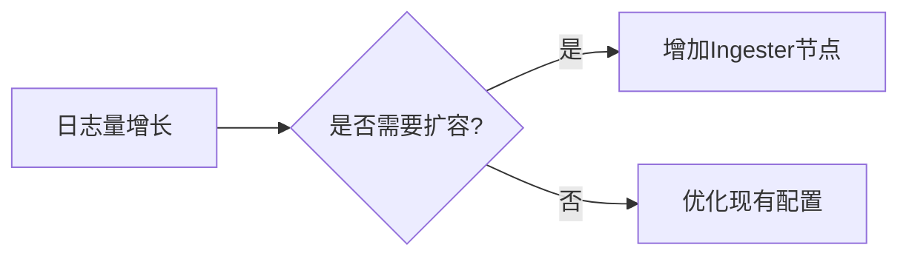

# 维护策略

## 介绍

在Grafana Loki的高可用性（High Availability, HA）部署中，维护策略是确保系统长期稳定运行的关键。维护策略包括定期备份、版本升级、性能监控和故障恢复等操作。对于初学者来说，理解这些策略的核心原则和实现方法，能够帮助你更好地管理Loki集群。

:::note
**什么是维护策略？**  
维护策略是一系列计划性操作，旨在预防潜在问题、优化性能，并在出现故障时快速恢复服务。
:::

---

## 核心维护策略

### 1. 定期备份

Loki的数据主要存储在对象存储（如S3、GCS）和索引存储（如DynamoDB、Cassandra）中。定期备份是防止数据丢失的重要措施。

#### 备份配置示例
使用`loki-backup`工具（假设已安装）进行备份：
```bash
loki-backup --output-dir /backups/loki --retention 30d
```
**输出示例：**
```
Backup completed successfully!
- Total files: 45
- Total size: 12.4 GB
- Retention: 30 days
```

:::caution
确保备份文件存储在与生产环境隔离的位置，例如异地存储或冷存储。
:::

---

### 2. 版本升级

升级Loki版本时，需遵循以下步骤：
1. **测试环境验证**：先在非生产环境测试新版本。
2. **滚动升级**：逐步替换集群中的节点，避免服务中断。
3. **回滚计划**：准备好旧版本的配置和镜像，以便快速回退。

#### 升级命令示例
使用Helm升级Loki（假设使用Kubernetes）：
```bash
helm upgrade loki grafana/loki --version 3.0.0 -f values.yaml
```

---

### 3. 监控与告警

通过Prometheus和Grafana监控Loki集群的健康状态。关键指标包括：
- 日志摄取延迟（`loki_ingester_samples_per_second`）
- 查询性能（`loki_query_frontend_queries_per_minute`）
- 存储可用性（`loki_storage_chunk_utilization`）

#### 告警规则示例
```yaml
- alert: HighIngestionLatency
  expr: rate(loki_ingester_samples_per_second[5m]) < 1000
  for: 10m
  labels:
    severity: critical
  annotations:
    summary: "Low log ingestion rate"
```

---

### 4. 容量规划

根据日志量增长趋势调整资源分配。例如：
- 动态扩展`ingester`节点以处理峰值负载。
- 调整`chunk_target_size`优化存储效率。



---

## 实际案例

**场景**：某电商平台在“双十一”期间日志量激增，导致Loki集群响应变慢。  
**解决方案**：
1. 提前扩容`ingester`节点至平时的2倍。
2. 启用查询缓存（`query_frontend`配置）。
3. 活动结束后缩容并备份数据。

---

## 总结

维护策略是Loki高可用性的基石，重点关注：
1. **备份**：防止数据丢失。
2. **升级**：确保兼容性和稳定性。
3. **监控**：实时发现问题。
4. **扩容**：应对业务增长。

---

## 附加资源
1. [Loki官方文档：运维指南](https://grafana.com/docs/loki/latest/operations/)
2. 练习：在测试环境中模拟一次Loki版本升级，并记录回滚步骤。