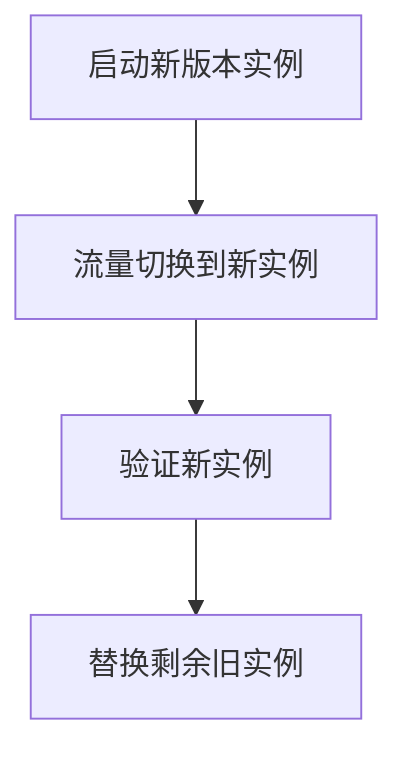

# 滚动升级

## 介绍

滚动升级（Rolling Upgrade）是一种在保持服务高可用性的同时逐步更新应用程序或系统组件的策略。在Grafana Loki中，滚动升级允许您逐步替换旧版本的实例，确保服务在整个升级过程中始终可用。这对于生产环境至关重要，因为它可以避免因一次性全部升级而导致的服务中断。

:::note
滚动升级的核心思想是逐步替换旧实例，确保系统在任何时候都有足够的实例处理请求。
:::

## 为什么需要滚动升级？

- **零停机时间**：避免因升级导致的服务不可用。
- **降低风险**：如果新版本出现问题，可以快速回滚到旧版本。
- **平滑过渡**：逐步替换实例，避免一次性全部升级带来的性能冲击。

## 滚动升级的工作原理

在Grafana Loki中，滚动升级通常通过以下步骤实现：

1. **启动新版本的实例**：首先启动一个或多个新版本的实例。
2. **将流量逐步切换到新实例**：通过负载均衡器或服务发现机制，逐步将流量从旧实例转移到新实例。
3. **验证新实例**：确保新实例正常运行并处理请求。
4. **逐步替换剩余旧实例**：重复上述过程，直到所有旧实例被替换。



## 实际操作示例

以下是一个使用Kubernetes实现Grafana Loki滚动升级的示例。假设您已经有一个运行旧版本Loki的Kubernetes部署。

### 1. 更新部署配置

首先，更新您的Kubernetes部署配置文件，将镜像版本从旧版本（如`grafana/loki:2.4.0`）更改为新版本（如`grafana/loki:2.5.0`）：

```yaml
apiVersion: apps/v1
kind: Deployment
metadata:
  name: loki
spec:
  replicas: 3
  strategy:
    type: RollingUpdate
    rollingUpdate:
      maxUnavailable: 1
      maxSurge: 1
  template:
    spec:
      containers:
      - name: loki
        image: grafana/loki:2.5.0
```

### 2. 应用更新

使用`kubectl apply`命令应用更新：

```bash
kubectl apply -f loki-deployment.yaml
```

Kubernetes将按照`RollingUpdate`策略逐步替换旧实例。`maxUnavailable: 1`表示最多允许1个实例不可用，`maxSurge: 1`表示最多可以临时增加1个新实例。

### 3. 监控升级过程

您可以通过以下命令监控升级进度：

```bash
kubectl rollout status deployment/loki
```

输出可能如下：

```
Waiting for deployment "loki" rollout to finish: 1 out of 3 new replicas have been updated...
Waiting for deployment "loki" rollout to finish: 2 out of 3 new replicas have been updated...
deployment "loki" successfully rolled out
```

## 真实案例

假设您的团队正在运行一个日志聚合系统，使用Grafana Loki收集和查询日志。由于业务增长，您需要升级Loki以支持新功能（如改进的查询性能）。通过滚动升级，您可以逐步将Loki从2.4.0升级到2.5.0，而不会影响正在运行的日志收集和查询服务。

:::tip
在实际生产环境中，建议先在测试环境中验证滚动升级过程，确保新版本与现有配置兼容。
:::

## 总结

滚动升级是确保Grafana Loki高可用性的关键策略。通过逐步替换旧实例，您可以避免服务中断，同时享受新版本的功能和性能改进。Kubernetes等编排工具提供了内置支持，简化了滚动升级的实现过程。

## 附加资源

- [Grafana Loki官方文档](https://grafana.com/docs/loki/latest/)
- [Kubernetes滚动升级指南](https://kubernetes.io/docs/tutorials/kubernetes-basics/update/update-intro/)
- [实践练习：尝试在本地Kubernetes集群中模拟滚动升级](https://minikube.sigs.k8s.io/docs/start/)