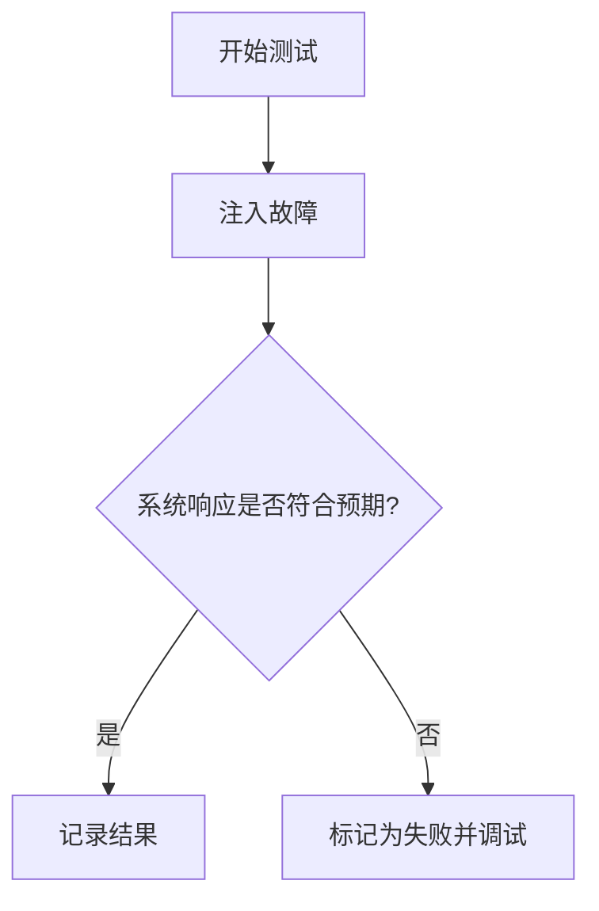
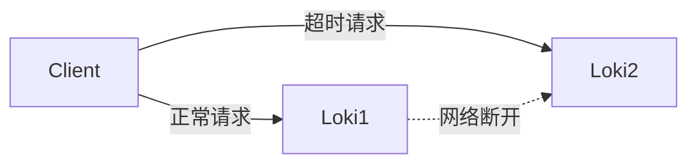

# 高可用系统测试

## 介绍

高可用性（High Availability, HA）是分布式系统的核心特性之一，它确保系统在部分组件故障时仍能提供服务。对于日志聚合系统如 **Grafana Loki**，高可用性测试是验证其容错能力的关键步骤。本节将介绍如何设计、实施和分析高可用性测试，涵盖从基础理论到实际操作的完整流程。

---

## 高可用性测试的核心目标

1. **故障注入**：模拟节点宕机、网络分区等场景。
2. **性能降级评估**：观察系统在部分故障时的吞吐量和延迟变化。
3. **自动恢复验证**：检查系统是否能自动检测故障并恢复服务。
4. **数据一致性检查**：确保故障期间无数据丢失或损坏。

---

## 测试策略

### 1. 定义测试场景

常见的测试场景包括：
- 单个Loki实例崩溃
- 分布式部署中的网络延迟或丢包
- 存储后端（如S3）不可用



### 2. 工具选择

推荐工具组合：
- **k6**：模拟负载并测量性能指标
- **Chaos Mesh**：在Kubernetes中注入故障
- **Grafana Dashboard**：可视化监控结果

---

## 实际操作示例

### 示例1：模拟Loki实例宕机

**步骤**：
1. 部署多实例Loki集群（例如3个副本）
2. 使用Chaos Mesh随机终止一个Pod：
   ```bash
   kubectl apply -f - <<EOF
   apiVersion: chaos-mesh.org/v1alpha1
   kind: PodChaos
   metadata:
     name: loki-kill-one-pod
   spec:
     action: pod-kill
     mode: one
     selector:
       labelSelector:
         matchLabels:
           app.kubernetes.io/name: loki
   EOF
   ```
3. 观察Grafana中的请求成功率是否仍保持99.9%以上

:::tip
使用`kubectl get pods -w`实时观察Pod重启过程，验证Kubernetes的自愈能力。
:::

### 示例2：网络分区测试



**验证要点**：
- 读写操作是否自动路由到健康节点
- 分区恢复后数据是否自动同步

---

## 真实案例：电商日志系统

某电商平台在黑色星期五期间：
- **场景**：某个可用区的Loki实例因负载过高崩溃
- **结果**：
  - 流量自动切换到其他实例
  - 崩溃实例恢复后，5分钟内完成数据同步
  - 最终零日志丢失

---

## 总结与进阶练习

### 关键结论
- 定期进行HA测试（建议每月一次）
- 监控指标应包含：请求成功率、恢复时间、数据同步延迟
- 始终保留手动干预的应急预案

### 练习建议
1. 在本地Minikube中部署Loki集群，使用`kubectl drain`模拟节点故障
2. 修改Loki配置`-target=all`为`-target=querier`，观察单点故障影响
3. 使用以下k6脚本测试故障期间的查询性能：
   ```javascript
   import http from 'k6/http';
   export let options = {
     vus: 10,
     duration: '1m',
   };
   export default function () {
     http.get('http://loki:3100/loki/api/v1/query?query={job="varlogs"}');
   }
   ```

### 扩展阅读
- [Loki官方HA文档](https://grafana.com/docs/loki/latest/operations/high-availability/)
- 《Site Reliability Engineering》第20章（Google SRE手册）