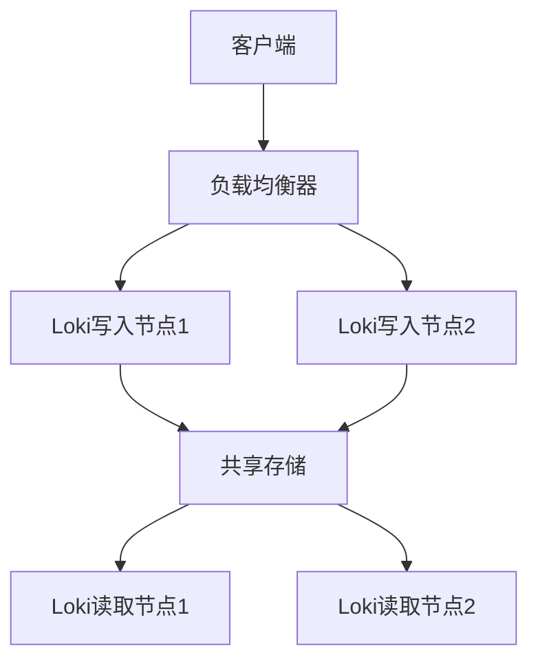

# 高可用最佳实践

## 介绍

高可用性（High Availability, HA）是指系统能够在预定的时间内持续提供服务的能力，即使部分组件发生故障。对于日志聚合系统如Grafana Loki来说，高可用性至关重要，因为它需要确保日志数据的完整性和可查询性，尤其是在生产环境中。

在Loki中实现高可用性通常涉及以下核心原则：
- **冗余部署**：多实例运行以避免单点故障
- **数据复制**：确保日志数据在多个位置有备份
- **负载均衡**：合理分配请求压力
- **故障自动转移**：当组件失效时能自动切换到备用系统

## Loki 高可用架构

Loki的高可用架构通常由以下组件组成：



## 配置实践

### 1. 多实例部署

在Kubernetes中部署多个Loki实例：

```yaml
# loki-distributed.yaml
loki:
  commonConfig:
    replication_factor: 3
  distributor:
    replicas: 2
  ingester:
    replicas: 3
    lifecycler:
      ring:
        replication_factor: 3
```

:::note
`replication_factor` 决定了数据在集群中的副本数量，通常设置为3以实现良好的冗余平衡。
:::

### 2. 使用共享存储

配置Loki使用高可用的对象存储：

```yaml
storage_config:
  aws:
    s3: s3://your-bucket/loki
    s3forcepathstyle: true
  gcs:
    bucket_name: your-bucket
  azure:
    container_name: loki
```

### 3. 配置读写分离

```yaml
query_frontend:
  replicas: 2
querier:
  replicas: 3
```

## 实际案例：电商平台日志系统

某电商平台在黑色星期五期间需要处理突增的日志流量，他们采用了以下高可用配置：

1. **写入层**：3个Distributor实例，5个Ingester实例
2. **存储层**：S3存储，跨3个可用区
3. **查询层**：2个Query Frontend，5个Querier实例

配置示例：

```yaml
limits_config:
  ingestion_rate_mb: 50
  ingestion_burst_size_mb: 100
  max_entries_limit_per_query: 50000
```

## 监控与告警

确保配置适当的监控来检测高可用性问题：

```yaml
# 监控规则示例
- alert: LokiIngesterUnavailable
  expr: sum(up{job="loki-ingester"}) < 2
  for: 10m
  labels:
    severity: critical
  annotations:
    summary: "Loki ingester availability below threshold"
```

## 总结

实现Grafana Loki的高可用性需要从多个层面考虑：
- 部署多个实例避免单点故障
- 配置适当的数据复制策略
- 使用可靠的共享存储后端
- 实施读写分离架构
- 设置全面的监控和告警

## 附加资源

1. [Loki官方文档 - 生产建议](https://grafana.com/docs/loki/latest/installation/production/)
2. [使用Prometheus监控Loki](https://grafana.com/docs/loki/latest/operations/monitoring/)
3. [Loki性能调优指南](https://grafana.com/docs/loki/latest/operations/tuning/)

## 练习

1. 在本地环境中部署一个2节点的Loki集群
2. 模拟节点故障，观察系统行为
3. 配置一个基本的告警规则，当可用节点少于2个时触发