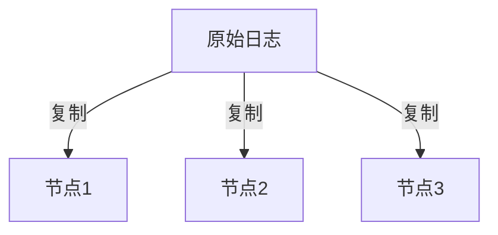
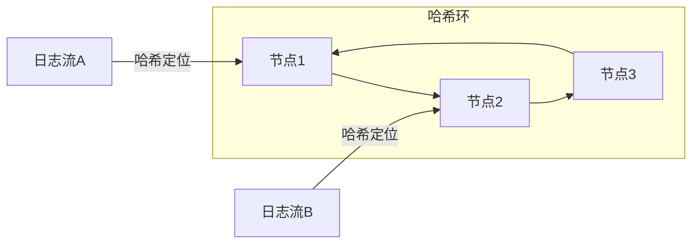

# 数据复制策略

## 介绍

在分布式日志系统Grafana Loki中，**数据复制策略**是保障高可用性的核心机制。它通过在多个节点上存储数据的副本来防止单点故障，确保即使部分节点失效时系统仍能正常提供服务。对于初学者来说，理解这一策略需要掌握三个关键点：
1. **副本因子（Replication Factor）**：定义每份数据存储的副本数量
2. **一致性哈希环**：决定副本在集群中的分布位置
3. **读写一致性级别**：控制数据一致性与可用性的平衡

## 副本因子工作原理

副本因子（通常记为`RF`）决定了数据被复制的次数。例如`RF=3`表示每段日志会被存储在3个不同的节点上：



在Loki配置中，通过`common.replication_factor`参数设置：

```yaml
common:
  replication_factor: 3
```

:::note 生产环境建议
- 开发环境：`RF=1`（无复制）
- 生产环境：`RF=3`（可容忍1个节点故障）
- 关键业务：`RF=5`（可容忍2个节点故障）
:::

## 一致性哈希环

Loki使用**一致性哈希环**来管理副本分布，确保：
- 数据均匀分布在所有节点上
- 节点增减时最小化数据迁移



## 读写一致性控制

Loki允许为读写操作设置不同的**一致性级别**：

| 级别          | 含义                          | 可用性影响 |
|---------------|-----------------------------|----------|
| `ONE`         | 只需1个副本响应               | 最高      |
| `QUORUM`      | 多数副本响应（RF/2 + 1）      | 中等      |
| `ALL`         | 所有副本必须响应              | 最低      |

配置示例：
```yaml
limits_config:
  enforce_metric_name: false
  replication_factor: 3
  # 写操作配置
  write:
    consistency: quorum
  # 读操作配置
  read:
    consistency: one
```

## 实际案例：电商日志系统

假设某电商平台使用Loki收集服务日志：
1. **需求**：黑五期间必须保证日志系统99.99%可用
2. **解决方案**：
   - 设置`RF=3`跨不同可用区
   - 写操作使用`QUORUM`级别
   - 读操作使用`ONE`级别

```go
// 查询时指定一致性级别（通过LogQL）
{app="checkout-service"} |= "payment_error"
// 在客户端设置
&query=...&consistency=one
```

当某个可用区断电时：
1. 剩余2个副本仍能满足`QUORUM`要求
2. 读操作可以从任意健康节点获取数据

## 总结

关键要点：
- 副本因子`RF`决定数据冗余度
- 哈希环实现自动负载均衡
- 一致性级别平衡可用性与数据准确性

最佳实践：
1. 根据业务需求选择适当的`RF`值
2. 生产环境至少使用`RF=3`
3. 写操作建议`QUORUM`，读操作可用`ONE`

## 延伸学习

练习建议：
1. 在本地Docker环境部署3节点Loki集群
2. 尝试动态调整`RF`并观察存储变化
3. 模拟节点故障测试系统容错能力

附加资源：
- [Loki官方文档 - 架构设计](https://grafana.com/docs/loki/latest/fundamentals/architecture/)
- [一致性哈希算法论文](https://www.cs.princeton.edu/courses/archive/fall09/cos518/papers/chash.pdf)