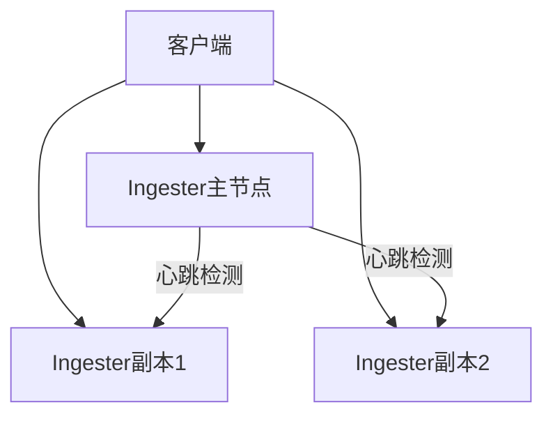

# 失败自动恢复

## 介绍

失败自动恢复（Automatic Failure Recovery）是分布式系统中高可用性的核心机制之一。在Grafana Loki中，它确保当某个组件发生故障时，系统能够自动检测、隔离故障并恢复服务，而无需人工干预。对于初学者来说，理解这一机制是构建可靠日志系统的关键。

:::tip 为什么需要失败自动恢复？
- 减少人工运维成本
- 提高系统整体可用性
- 防止单点故障导致服务中断
:::

## 基础概念

### 1. 健康检查（Health Checks）

Loki组件通过定期健康检查来监控自身状态。例如，使用HTTP端点 `/ready` 和 `/healthy`：

```bash
# 手动检查Loki健康状态
curl http://localhost:3100/ready
curl http://localhost:3100/healthy
```

预期输出：
```
ready
```

### 2. 副本与冗余

Loki通过多副本部署关键组件（如Ingester）实现冗余。当主副本失败时，副本会自动接管工作。



### 3. 数据复制

Loki使用成员列表（Memberlist）协议在节点间同步数据：

```yaml
# Loki 配置片段
memberlist:
  join_members:
    - "loki-1.cluster.local"
    - "loki-2.cluster.local"
  bind_port: 7946
```

## 实际案例

### 场景：Ingester节点崩溃

1. **故障检测**：其他节点通过心跳检测发现主Ingester无响应（默认超时时间5秒）
2. **自动切换**：副本Ingester提升为主节点
3. **数据恢复**：从持久化存储（如S3）恢复未确认的日志数据

:::note 恢复时间
典型恢复时间为10-30秒，具体取决于：
- 网络延迟
- 数据量大小
- 存储后端性能
:::

## 配置实践

### 启用多副本模式

```yaml
# config.yaml
ingester:
  lifecycler:
    ring:
      kvstore:
        store: memberlist
      replication_factor: 3  # 推荐至少3个副本
```

### 调整超时参数

```yaml
distributor:
  health_check_timeout: 5s
  remote_timeout: 2s
```

## 验证恢复机制

1. 部署3节点Loki集群
2. 模拟节点故障：
   ```bash
   docker stop loki-ingester-1
   ```
3. 观察日志：
   ```bash
   kubectl logs -f loki-ingester-2 | grep "assuming leadership"
   ```
4. 验证查询是否正常：
   ```bash
   curl -G http://localhost:3100/loki/api/v1/query_range?query={job="varlogs"}
   ```

## 总结

失败自动恢复使Loki能够：
- 自动处理节点故障
- 保持服务连续性
- 确保数据完整性

## 延伸学习

1. **实践练习**：
   - 部署本地Loki集群并手动触发故障恢复
   - 调整 `replication_factor` 观察系统行为变化

2. **推荐阅读**：
   - [Loki官方文档 - 运维指南](https://grafana.com/docs/loki/latest/operations/)
   - 《Designing Data-Intensive Applications》中"容错"章节

:::caution 生产环境注意事项
- 始终监控 `loki_build_info{job="loki"}` 指标
- 定期测试故障恢复流程
- 容量规划应包含故障转移所需的额外资源
:::