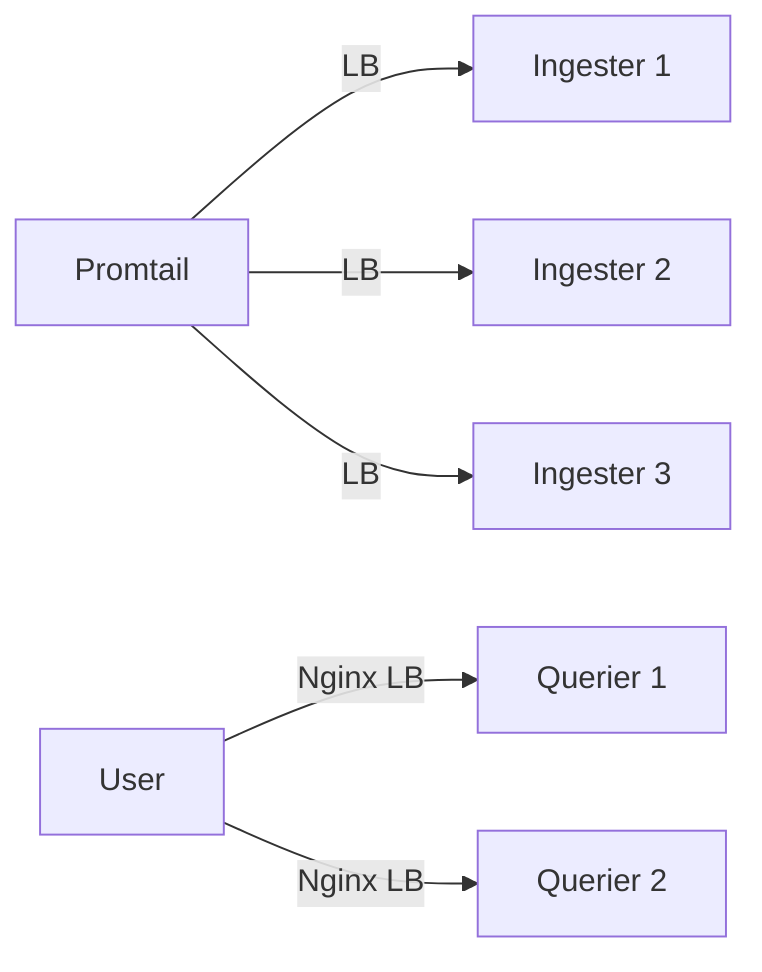

# 负载均衡配置

## 介绍

负载均衡（Load Balancing）是分布式系统中实现高可用性和性能扩展的核心技术之一。在Grafana Loki中，负载均衡的作用是将请求均匀分配到多个服务实例上，避免单点过载，同时提升系统的容错能力。本章将介绍负载均衡的基本原理、Loki中的配置方法以及实际应用场景。

:::note 为什么需要负载均衡？
- **提高吞吐量**：通过分发请求到多个节点，充分利用资源。
- **增强可用性**：某个节点故障时，其他节点仍可处理请求。
- **降低延迟**：选择最优节点响应请求。
:::

---

## 基础概念

### 1. 负载均衡的类型
在Loki中，常见的负载均衡方式包括：
- **客户端负载均衡**：客户端（如Promtail）主动分配请求目标。
- **服务端负载均衡**：通过反向代理（如Nginx）分发请求。

### 2. 关键组件
- **Ingester**：Loki的写入组件，需均衡日志写入压力。
- **Querier**：查询组件，需均衡查询请求。

---

## 配置方法

### 1. 客户端负载均衡（Promtail配置）
在Promtail的配置文件中，可以通过 `clients` 字段指定多个Loki的写入目标：

```yaml
clients:
  - url: http://loki-1:3100/loki/api/v1/push
  - url: http://loki-2:3100/loki/api/v1/push
  - url: http://loki-3:3100/loki/api/v1/push
```

Promtail会自动以轮询（Round-Robin）方式将日志推送到不同的Loki实例。

:::tip 动态发现
如果使用Kubernetes，可以通过服务发现自动获取Loki实例地址：

```yaml
clients:
  - url: http://loki-headless.<namespace>.svc.cluster.local:3100/loki/api/v1/push
```
:::

### 2. 服务端负载均衡（Nginx配置）
使用Nginx作为反向代理的示例：

```nginx
upstream loki-write {
  server loki-1:3100;
  server loki-2:3100;
  server loki-3:3100;
}

server {
  listen 3100;
  location / {
    proxy_pass http://loki-write;
  }
}
```

所有写入请求会被Nginx分发到后端的Loki实例。

---

## 实际案例

### 场景：电商日志系统
假设一个电商平台需要处理以下流量：
- **写入**：每秒10万条日志（订单、用户行为）。
- **查询**：频繁的实时分析（如促销活动监控）。

**解决方案**：
1. **写入层**：部署3个Loki Ingester，通过Promtail客户端负载均衡推送日志。
2. **查询层**：使用Nginx轮询查询请求到多个Querier实例。



---

## 总结

- **负载均衡是Loki高可用的关键**：通过分散请求提升性能和可靠性。
- **灵活选择方式**：客户端LB适合写入，服务端LB适合查询。
- **监控必不可少**：使用Grafana监控各节点负载，及时调整配置。

---

## 延伸学习

1. **进阶阅读**：
   - [Loki官方文档 - 生产部署建议](https://grafana.com/docs/loki/latest/installation/production/)
   - [Nginx负载均衡策略](https://docs.nginx.com/nginx/admin-guide/load-balancer/)

2. **动手练习**：
   - 在本地用Docker启动2个Loki实例，配置Promtail轮询写入。
   - 使用`k6`工具模拟高并发查询，观察Nginx的负载均衡效果。