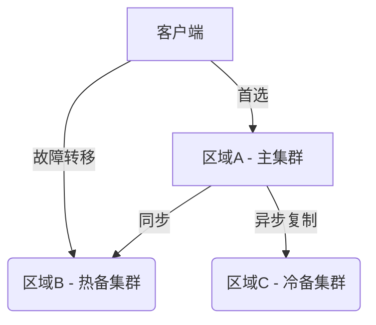

# 区域容灾部署

## 介绍

区域容灾部署（Multi-Region Disaster Recovery）是分布式系统高可用性的关键策略。在Grafana Loki的上下文中，它意味着将日志数据跨多个地理区域复制，确保即使整个区域发生故障（如自然灾害、网络中断），系统仍能继续提供服务。

:::note 为什么需要区域容灾？
- 避免单点故障导致全局服务中断
- 满足合规性要求（如GDPR的数据冗余要求）
- 为全球用户提供低延迟访问
:::

## 核心概念

### 1. 数据复制策略

Loki通过以下机制实现跨区域数据同步：

```yaml
# loki-config.yaml 示例
common:
  replication_factor: 3
storage_config:
  gcs:
    bucket_name: "loki-logs-multi-region"
  azure:
    container_name: "loki-backup"
```

关键参数说明：
- `replication_factor`：决定数据副本数量（通常≥3）
- 混合云存储：结合不同云提供商的对象存储（如GCS+Azure）

### 2. 部署拓扑



### 3. 故障转移流程

1. 健康检查检测区域A故障
2. DNS记录自动指向区域B
3. 区域B提升为主集群
4. 客户端重试机制确保无缝切换

## 实战配置

### 示例：配置跨区域存储

```go
// 使用Loki的S3多区域配置
storage_config:
  aws:
    s3: s3://loki-primary
    s3forcepathstyle: true
  backend: s3
  bucket_names:
    - "loki-us-west"
    - "loki-eu-central"
    - "loki-ap-southeast"
```

### 验证数据同步

```bash
# 检查各区域数据一致性
loki-cli query --region=us-west '{job="nginx"}'
loki-cli query --region=eu-central '{job="nginx"}'
```

预期输出应显示相同的时间戳和日志内容。

## 真实案例：电商平台日志系统

**场景需求**：
- 处理黑色星期五的流量高峰
- 遵守欧盟数据本地化要求
- 99.99%的可用性SLA

**解决方案**：
1. 在AWS法兰克福（eu-central-1）部署主集群
2. 在AWS东京（ap-northeast-1）部署热备集群
3. 使用GCS亚太区域作为冷存储
4. 配置5分钟RPO（恢复点目标）

:::tip 最佳实践
- 使用`-promtail`的`client`配置实现区域感知日志收集
- 为每个区域部署独立的Grafana实例进行本地查询
- 定期进行灾难恢复演练
:::

## 常见问题解决

**问题1**：跨区域延迟导致写入冲突  
**方案**：启用Loki的`write_throughput`限流

```yaml
limits_config:
  ingestion_rate_mb: 20
  ingestion_burst_size_mb: 25
```

**问题2**：网络成本过高  
**方案**：使用`chunk_target_size`优化传输

```yaml
chunk_store_config:
  chunk_target_size: 1572864 # 1.5MB
```

## 总结

区域容灾部署通过地理冗余大幅提升Loki的可靠性，关键要点包括：
- 最少部署3个区域（主+备+冷）
- 合理设置复制因子和存储后端
- 自动化故障转移机制
- 定期测试恢复流程

## 延伸学习

1. 使用`chaos-mesh`测试容灾能力
2. 研究Loki与Kubernetes集群联邦的集成
3. 探索`thanos`的跨区域监控方案

```bash
# 练习：模拟区域故障
kubectl --context=eu-cluster delete pod -l app=loki
```

观察流量如何自动切换到其他区域，并记录切换时间。