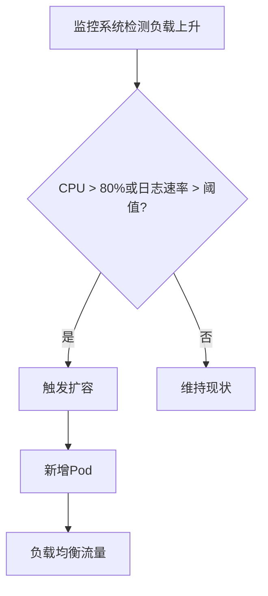

# 自动扩缩容配置

## 介绍

自动扩缩容（Autoscaling）是Grafana Loki高可用性的核心功能之一，它允许系统根据实际负载动态调整资源分配。对于初学者来说，理解这一机制可以帮助你优化Loki集群的性能和成本。

:::tip 为什么需要自动扩缩容？
- 应对流量波动：日志量可能因业务活动（如促销活动）突然激增
- 资源优化：避免在低负载时浪费资源
- 高可用性保障：确保服务在高峰期仍能稳定运行
:::

## 基础概念

Loki的自动扩缩容主要通过以下两种方式实现：

1. **水平扩缩容**：增减Loki组件的Pod数量（适用于查询器、摄取器等无状态组件）
2. **垂直扩缩容**：调整单个Pod的资源限制（适用于所有组件）

## Kubernetes中的实现

Loki通常部署在Kubernetes环境中，我们可以使用Horizontal Pod Autoscaler (HPA)来实现自动扩缩容。

### 水平扩缩容配置示例

以下是一个典型的HPA配置示例，用于Loki的查询前端组件：

```yaml
apiVersion: autoscaling/v2
kind: HorizontalPodAutoscaler
metadata:
  name: loki-query-frontend
spec:
  scaleTargetRef:
    apiVersion: apps/v1
    kind: Deployment
    name: loki-query-frontend
  minReplicas: 2
  maxReplicas: 10
  metrics:
  - type: Resource
    resource:
      name: cpu
      target:
        type: Utilization
        averageUtilization: 70
```

关键参数说明：
- `minReplicas`：最小Pod数量（确保基本可用性）
- `maxReplicas`：最大Pod数量（防止资源耗尽）
- `target CPU利用率`：触发扩缩容的阈值

### 自定义指标扩缩容

对于更精细的控制，可以使用自定义指标（如日志摄入速率）：

```yaml
metrics:
- type: Pods
  pods:
    metric:
      name: loki_ingester_bytes_received_total
    target:
      type: AverageValue
      averageValue: 10MB
```

## 实际案例：电商大促场景

假设一个电商平台在"双十一"期间：

1. **平时配置**：
   - 3个查询器Pod
   - 每个Pod限制为2CPU/4GB内存

2. **大促配置**（通过自动扩缩容）：
   - 自动扩展到10个查询器Pod
   - CPU阈值设为80%利用率
   - 基于日志摄入速率增加Ingester数量



## 最佳实践

1. **渐进式扩缩**：
   - 设置合理的冷却时间（`--horizontal-pod-autoscaler-downscale-stabilization`）
   - 避免过于频繁的扩缩操作

2. **资源限制**：
   ```yaml
   resources:
     limits:
       cpu: "2"
       memory: "4Gi"
     requests:
       cpu: "1"
       memory: "2Gi"
   ```

3. **多维度监控**：
   - 同时监控CPU、内存和自定义指标
   - 设置适当的告警阈值

:::caution 注意事项
- 确保有足够的集群资源应对最大扩容需求
- 测试扩缩容速度是否能满足业务需求
- 为有状态组件（如Ingester）配置适当的持久化存储
:::

## 总结

自动扩缩容是Loki高可用架构的关键组成部分。通过合理配置：

- 提高系统弹性，应对突发流量
- 优化资源使用，降低成本
- 减少人工干预，提高运维效率

## 延伸学习

1. **实践练习**：
   - 在测试集群部署Loki并配置HPA
   - 使用`kubectl apply -f`应用上面的示例配置
   - 使用`kubectl get hpa`监控扩缩容状态

2. **进一步阅读**：
   - Kubernetes官方HPA文档
   - Loki官方文档中的"运维最佳实践"章节
   - Prometheus指标监控与告警配置

3. **调试命令**：
   ```bash
   # 查看HPA状态
   kubectl describe hpa loki-query-frontend
   
   # 查看Pod资源使用
   kubectl top pods -n loki
   ```

通过掌握这些知识，你将能够构建更具弹性和可靠性的Loki日志系统。