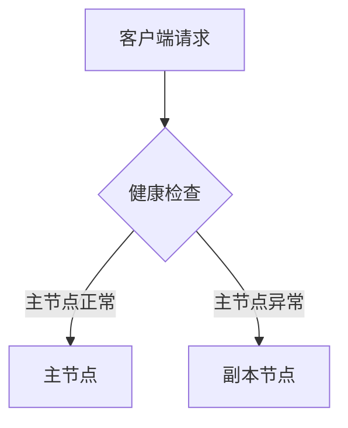

# 故障转移机制

## 介绍

故障转移（Failover）是分布式系统中实现高可用性的关键技术。当主服务节点发生故障时，系统能够自动将流量切换到备用节点，从而保证服务不间断运行。在Grafana Loki中，故障转移机制通过多副本部署和健康检查实现日志收集与查询的持续可用性。

:::note 初学者提示
故障转移的核心目标是 **"用户无感知"** —— 即使部分节点失效，系统仍能正常响应请求。
:::

## 工作原理

Loki的故障转移机制主要依赖以下组件：

1. **服务发现**：通过Kubernetes或Consul等工具监控节点状态
2. **健康检查**：定期检测节点可用性（HTTP端点或TCP端口）
3. **流量切换**：当主节点不可用时，负载均衡器将请求路由到健康节点



## 配置示例

以下是Loki的分布式模式配置片段，展示如何设置多副本：

```yaml
# loki-config.yaml
target: 'all'
auth_enabled: false

memberlist:
  join_members:
    - "loki-1.cluster.local"
    - "loki-2.cluster.local"

ingester:
  lifecycler:
    ring:
      replication_factor: 2  # 每个日志流保存2个副本
```

关键参数说明：
- `replication_factor: 2` 表示数据会在不同节点存储两份
- `join_members` 指定集群节点地址，用于自动发现和状态同步

## 实际案例

**场景**：电商平台日志系统
- 问题：黑色星期五流量激增导致部分节点过载
- 解决方案：
  1. 配置3节点Loki集群
  2. 设置 `replication_factor: 3`
  3. 当节点A CPU达到90%时，负载均衡器自动将查询请求转移到节点B/C

:::warning 注意
故障转移不是万能的！必须配合：
- 足够的副本数量
- 合理的资源监控
- 定期的故障演练
:::

## 测试方法

使用`curl`模拟健康检查失败场景：

```bash
# 正常状态检查
curl http://loki-1:3100/ready

# 手动停用主节点后观察响应
# 预期输出：自动切换到副本节点的IP
curl http://loki-lb:3100/api/prom/label
```

## 总结

关键要点：
- 故障转移通过 **冗余+自动切换** 实现高可用
- Loki需要配置正确的 `replication_factor`
- 生产环境建议至少3节点部署

## 延伸学习

推荐练习：
1. 在本地用Docker搭建2节点Loki集群
2. 手动停止一个容器，观察查询是否仍然可用
3. 修改 `replication_factor` 值，测试数据完整性

进阶资源：
- [Loki官方文档 - 生产部署建议](https://grafana.com/docs/loki/latest/installation/)
- 《分布式系统：概念与设计》故障恢复章节