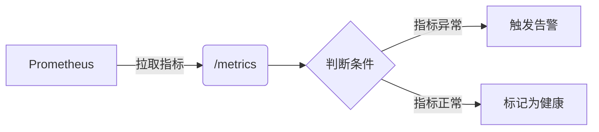

# 健康检查设置

## 介绍

健康检查（Health Check）是分布式系统中确保服务高可用性的核心机制。在Grafana Loki中，健康检查用于监控各组件的运行状态（如`ingester`、`querier`等），并在组件异常时触发告警或自动恢复。通过本文，您将学会如何为Loki配置健康检查，并理解其工作原理。

:::note 为什么需要健康检查？
- 快速发现故障组件
- 避免请求被路由到不可用节点
- 支持自动扩缩容和自愈
:::

## 基础配置

Loki的健康检查通过HTTP端点`/ready`和`/healthy`暴露状态。以下是一个基础配置示例：

```yaml
# loki-config.yaml
server:
  http_listen_port: 3100
  grpc_listen_port: 9095
  http_server_read_timeout: 1m
  http_server_write_timeout: 1m
  grpc_server_max_recv_msg_size: 104857600
  grpc_server_max_send_msg_size: 104857600
  grpc_server_max_concurrent_streams: 1000
  # 健康检查配置
  health_check_url: /health
  readiness_check_url: /ready
```

### 检查端点说明
| 端点      | 用途                          | 预期响应 |
|-----------|-----------------------------|----------|
| `/ready`  | 组件是否准备好接收流量          | HTTP 200 |
| `/health` | 组件是否正常运行（不保证可接收流量） | HTTP 200 |

## 实际案例：Kubernetes部署

在Kubernetes中，您可以通过`livenessProbe`和`readinessProbe`实现健康检查：

```yaml
# deployment.yaml
containers:
- name: loki
  image: grafana/loki:latest
  ports:
  - containerPort: 3100
  livenessProbe:
    httpGet:
      path: /health
      port: 3100
    initialDelaySeconds: 15
    periodSeconds: 10
  readinessProbe:
    httpGet:
      path: /ready
      port: 3100
    initialDelaySeconds: 5
    periodSeconds: 5
```

:::tip 参数建议
- `initialDelaySeconds`: 组件启动后等待时间
- `periodSeconds`: 检查频率
- `failureThreshold`: 连续失败次数阈值
:::

## 自定义健康检查

对于高级场景，您可以通过Loki的`/metrics`端点结合Prometheus实现自定义检查：



示例Prometheus告警规则：
```yaml
groups:
- name: loki-health
  rules:
  - alert: LokiIngesterUnhealthy
    expr: up{job="loki", instance=~".*:3100"} == 0
    for: 5m
    labels:
      severity: critical
    annotations:
      summary: "Loki ingester {{ $labels.instance }} is down"
```

## 常见问题排查

:::caution 典型问题
1. **误报健康状态**  
   - 原因：检查间隔过长（调整`periodSeconds`）
   - 解决方案：缩短检查间隔，结合业务指标判断

2. **启动时被标记为不健康**  
   - 原因：`initialDelaySeconds`设置过短
   - 解决方案：根据组件实际启动时间调整

3. **端点响应慢**  
   - 原因：系统负载过高
   - 解决方案：优化查询或增加资源
:::

## 总结

健康检查是Loki高可用性的基石。关键要点：
- 区分`/ready`和`/health`的使用场景
- 在Kubernetes中合理配置`livenessProbe`和`readinessProbe`
- 通过Prometheus实现自定义监控

## 扩展练习
1. 在本地Docker环境部署Loki并测试健康端点
2. 使用`curl -v http://localhost:3100/ready`手动验证状态
3. 尝试修改`failureThreshold`观察Kubernetes的行为变化