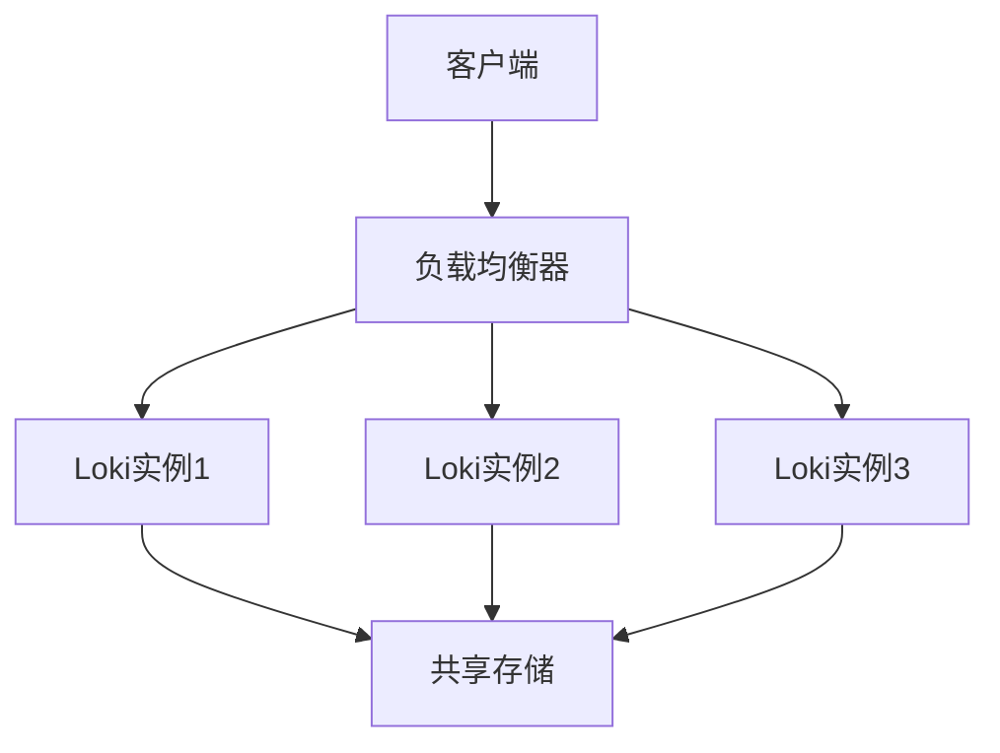

# 高可用性监控

## 介绍

高可用性（High Availability, HA）是分布式系统的核心特性之一，尤其在监控和日志系统中至关重要。Grafana Loki作为一款可扩展的日志聚合系统，通过多副本部署、负载均衡和故障转移等机制实现高可用性。本章将介绍如何配置和管理Loki的高可用性监控，确保系统在部分节点故障时仍能正常运行。

---

## 为什么需要高可用性监控？

在分布式环境中，单个节点的故障可能导致数据丢失或服务中断。高可用性监控的目标是：
1. **减少单点故障**：通过多副本部署避免依赖单一节点。
2. **自动故障恢复**：当节点故障时，系统能自动切换到健康节点。
3. **负载均衡**：均匀分配请求压力，避免单个节点过载。

:::tip
高可用性不仅仅是“多部署几个实例”，还需要配合正确的配置和监控策略。
:::

---

## Loki 的高可用性架构

Loki的高可用性主要通过以下组件实现：
1. **多副本部署**：运行多个Loki实例，分布在不同的物理节点上。
2. **共享存储**：使用对象存储（如S3、GCS）或分布式文件系统（如Ceph）持久化数据。
3. **服务发现与负载均衡**：通过Consul、Kubernetes Service等工具实现流量分发。



---

## 配置多副本Loki

以下是一个Loki多副本配置示例（`loki-config.yaml`）：

```yaml
auth_enabled: false
server:
  http_listen_port: 3100
memberlist:
  join_members:
    - "loki-1"
    - "loki-2"
    - "loki-3"
schema_config:
  configs:
    - from: 2020-10-24
      store: boltdb-shipper
      object_store: s3
      schema: v11
storage_config:
  boltdb_shipper:
    active_index_directory: /var/loki/index
    shared_store: s3
  aws:
    s3: s3://your-bucket-name
```

关键配置说明：
- `memberlist.join_members`：指定集群中所有Loki实例的地址。
- `shared_store`：所有实例共享同一存储后端（如S3）。

:::caution
确保所有实例的时钟同步（使用NTP），否则可能导致日志时间戳混乱。
:::

---

## 实际案例：电商平台的日志监控

假设一个电商平台使用Loki监控订单服务的日志：
1. **场景需求**：
   - 每天处理100万条日志。
   - 容忍单节点故障，无数据丢失。
2. **解决方案**：
   - 部署3个Loki实例，分布在不同的可用区。
   - 使用S3作为共享存储。
   - 配置Prometheus监控Loki实例的健康状态。

故障模拟：
- 当`loki-1`宕机时，负载均衡器自动将流量切换到`loki-2`和`loki-3`。
- 由于数据存储在S3，其他实例仍能访问完整日志。

---

## 验证高可用性

通过以下命令测试Loki集群状态：

```bash
# 查看集群成员
curl http://loki-1:3100/memberlist
```

预期输出：
```json
{
  "members": [
    {"name": "loki-1", "addr": "10.0.0.1"},
    {"name": "loki-2", "addr": "10.0.0.2"},
    {"name": "loki-3", "addr": "10.0.0.3"}
  ]
}
```

---

## 总结

高可用性监控是Loki在生产环境中稳定运行的关键。通过多副本部署、共享存储和负载均衡，可以显著提升系统的容错能力。记住：
1. 至少部署3个实例以避免“脑裂”问题。
2. 使用可靠的共享存储（如S3）。
3. 监控集群健康状态，及时处理故障。

---

## 扩展练习
1. 在本地使用Docker Compose部署一个3节点的Loki集群。
2. 模拟节点宕机，观察日志查询是否受影响。
3. 尝试配置Prometheus告警规则，当Loki实例不可用时触发通知。

## 附加资源
- [Loki官方文档 - 高可用性](https://grafana.com/docs/loki/latest/operations/high-availability/)
- 《分布式系统：概念与设计》第5章（高可用性设计）