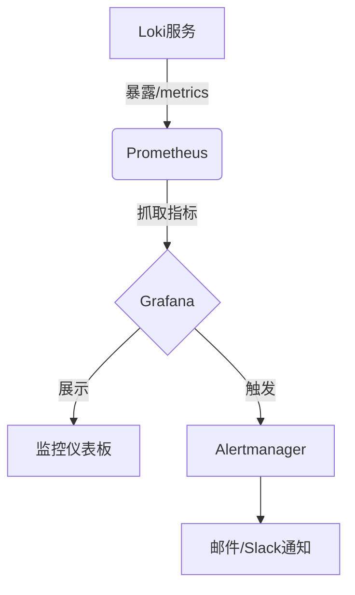

# Loki 自监控配置

## 介绍

Grafana Loki的自监控功能允许你跟踪Loki实例自身的运行状态和性能指标。通过配置自监控，你可以及时发现潜在问题（如高延迟、存储错误等），并通过告警系统通知运维团队。本指南将逐步介绍如何启用和优化Loki的自监控配置。

:::note 为什么需要自监控？
- 确保Loki服务稳定性
- 快速定位性能瓶颈
- 满足运维SLA要求
:::

## 基础配置

### 1. 启用Loki指标暴露

在Loki配置文件（通常为`loki.yaml`）中启用Prometheus指标暴露：

```yaml
metrics:
  # 启用Prometheus格式的指标
  enable_http: true
  # 指标暴露路径（默认为/metrics）
  http_path_prefix: /metrics
  # 禁用非必要指标以减少负载
  disable_metrics: false
  # 自定义指标采集间隔
  interval: 15s
```

### 2. Prometheus抓取配置

在Prometheus的`scrape_configs`中添加Loki监控目标：

```yaml
scrape_configs:
  - job_name: 'loki'
    static_configs:
      - targets: ['loki:3100'] # Loki 服务地址
    metrics_path: '/metrics'
```

## 关键监控指标

Loki提供的关键自监控指标包括：

| 指标名称                          | 说明                          | 告警阈值建议        |
|-----------------------------------|-----------------------------|-------------------|
| `loki_request_duration_seconds`   | 请求处理延迟                  | P99 > 2s         |
| `loki_log_messages_total`         | 处理的日志条目数量            | 突然下降50%       |
| `loki_ingester_memory_streams`    | 内存中的日志流数量            | > 80% 内存限制   |
| `loki_storage_retention_period`   | 存储保留周期符合性            | 低于配置值        |

## 告警规则示例

在Prometheus中配置Loki健康告警规则：

```yaml
groups:
- name: loki-health
  rules:
  - alert: LokiHighRequestLatency
    expr: histogram_quantile(0.99, sum(rate(loki_request_duration_seconds_bucket[1m])) by (le)) > 2
    for: 5m
    labels:
      severity: critical
    annotations:
      summary: "Loki high request latency (instance {{ $labels.instance }})"
      description: "Loki request latency is high: {{ $value }}s"
```

## 实际案例：存储故障检测

以下配置可检测到存储写入失败：

```yaml
- alert: LokiStorageWriteErrors
  expr: rate(loki_storage_failures_total{job="loki", reason="storage"}[5m]) > 0
  for: 10m
  labels:
    severity: warning
  annotations:
    summary: "Loki storage write errors (instance {{ $labels.instance }})"
    description: "Loki is failing to write to storage: {{ $value }} errors/minute"
```

## 可视化配置

在Grafana中导入官方Loki监控仪表板（ID: 13639），或使用以下Mermaid图理解数据流：



## 高级配置技巧

### 1. 指标标签优化

通过`metric_relabel_configs`减少指标基数：

```yaml
metric_relabel_configs:
- source_labels: [__name__]
  regex: 'loki_cache_.*'
  action: keep
```

### 2. 多实例监控

当运行Loki集群时，使用服务发现自动监控所有实例：

```yaml
scrape_configs:
  - job_name: 'loki-cluster'
    kubernetes_sd_configs:
      - role: pod
        namespaces:
          names: ['loki']
    relabel_configs:
      - source_labels: [__meta_kubernetes_pod_label_app_kubernetes_io_name]
        regex: loki
        action: keep
```

## 总结

通过合理配置Loki自监控，你可以：
- 实时掌握系统健康状态
- 快速响应性能问题
- 预测容量需求

:::tip 最佳实践
1. 从核心指标开始，逐步扩展
2. 设置合理的告警阈值
3. 定期审查监控项的有效性
:::

## 延伸学习

1. [官方监控文档](https://grafana.com/docs/loki/latest/operations/monitoring/)
2. 练习：设置一个检测日志摄取速率的告警规则
3. 在测试环境模拟存储故障，观察监控系统响应