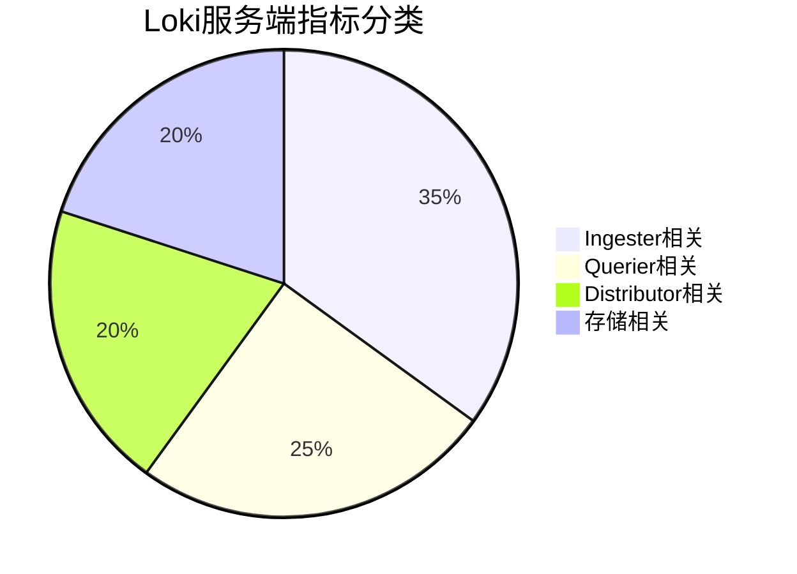

# Loki 指标详解

## 介绍

在日志监控系统中，指标（Metrics）是理解系统行为和性能的关键。Grafana Loki虽然主要处理日志数据，但通过其内置的指标功能，您可以：

1. 监控日志流量和错误率
2. 分析日志存储效率
3. 设置基于日志内容的告警规则

:::note 指标 vs 日志
指标是数值型的时间序列数据（如"每秒错误日志数"），而日志是原始的文本事件记录。Loki巧妙地将两者结合，让您能从日志中提取指标。
:::

## 核心指标类型

### 1. Loki服务端指标

这些指标展示Loki服务本身的运行状态：



关键指标示例：
- `loki_request_duration_seconds_bucket`: 请求延迟分布
- `loki_log_messages_total`: 处理的日志消息总数
- `loki_ingester_memory_chunks`: 内存中的chunk数量

### 2. 日志提取指标（Log-based Metrics）

通过LogQL从日志内容中生成：

```promql
# 计算每个namespace的HTTP 500错误率
sum by (namespace) (
  rate({job="myapp"} |= "error" | logfmt | status_code="500" [5m])
)
```

## 指标查询实战

### 示例1：监控日志摄入速率

```promql
sum(rate({job="nginx"} [1m])) by (level)
```

输出示例：
```
{level="error"} 2.5
{level="warn"}  15.7
{level="info"}  142.3
```

### 示例2：检测异常日志模式

```promql
# 查找最近10分钟内出现频率突然升高的日志模式
count_over_time(
  {cluster="prod"} 
  | pattern `<ip> <user> <method> <path> <status>` 
  | line_format "{{.method}} {{.path}} {{.status}}"
  [10m]
)
```

## 告警规则配置

在Loki中通过`recording rules`创建指标，然后在Alertmanager中设置告警：

```yaml
groups:
- name: loki-alerts
  rules:
  - alert: HighErrorRate
    expr: |
      sum(rate({job="myapp"} |~ "ERROR" [5m])) by (service)
      /
      sum(rate({job="myapp"}[5m])) by (service)
      > 0.05
    for: 10m
    labels:
      severity: critical
    annotations:
      summary: "High error rate on {{ $labels.service }}"
      description: "Error rate is {{ $value }}"
```

## 实际应用场景

**案例：电商平台监控**

1. **用户行为分析**:
   ```promql
   # 追踪结账流程中的错误
   rate({app="checkout"} | json | message=~"payment.*failed" [5m])
   ```

2. **库存预警**:
   ```promql
   # 当库存警告日志频率超过阈值时触发
   count_over_time({app="inventory"} |= "low stock" [15m]) > 5
   ```

## 总结

关键要点：
- Loki提供系统指标和日志衍生指标两种类型
- 使用LogQL可以灵活地从日志中提取数值指标
- 结合Recording Rules和Alertmanager实现完整监控链路

## 延伸学习

推荐练习：
1. 在测试环境部署Loki，观察默认暴露的指标
2. 尝试为您的应用日志创建自定义指标
3. 设置一个基于日志频率的简单告警

附加资源：
- [官方LogQL文档](https://grafana.com/docs/loki/latest/logql/)
- [Prometheus指标类型详解](https://prometheus.io/docs/concepts/metric_types/)