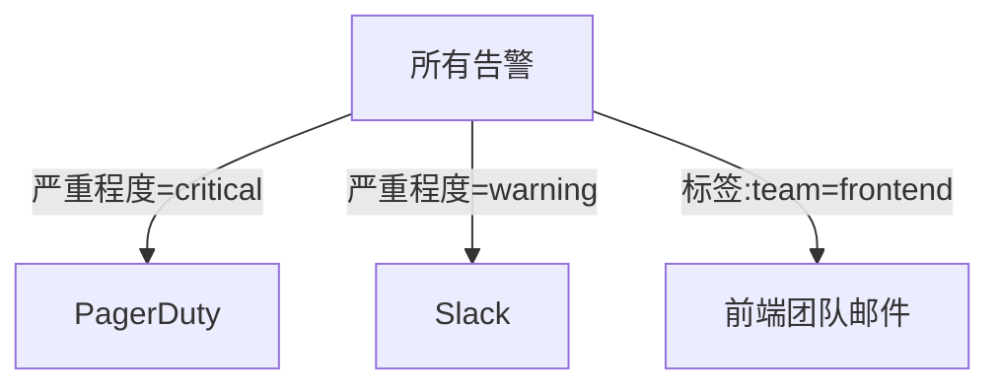

# 告警通知渠道

告警通知渠道是监控系统中至关重要的一环，它决定了当系统检测到异常时，如何将告警信息传递给相关人员。在Grafana Loki中，你可以配置多种通知渠道，确保团队能够及时响应问题。

## 什么是告警通知渠道？

告警通知渠道定义了告警信息传递的路径。当Loki的告警规则被触发时，告警信息会通过预先配置的渠道发送给指定的接收者。常见的通知渠道包括：

- 电子邮件（Email）
- Slack
- PagerDuty
- Webhook
- 等等

## 配置通知渠道

在Grafana Loki中，通知渠道通常通过Alertmanager配置。以下是一个典型的配置示例：

```yaml
route:
  receiver: 'slack-notifications'
  group_by: ['alertname']
  group_wait: 30s
  group_interval: 5m
  repeat_interval: 4h

receivers:
- name: 'slack-notifications'
  slack_configs:
  - api_url: 'https://hooks.slack.com/services/XXXXX/XXXXX/XXXXX'
    channel: '#alerts'
    send_resolved: true
    text: |-
      {{ range .Alerts }}
        *Alert:* {{ .Annotations.summary }}
        *Description:* {{ .Annotations.description }}
        *Severity:* {{ .Labels.severity }}
      {{ end }}
```

:::note
确保替换 `api_url` 为你自己的Slack Webhook URL。
:::

## 常见通知渠道示例

### 1. 电子邮件通知

```yaml
receivers:
- name: 'email-notifications'
  email_configs:
  - to: 'team@example.com'
    from: 'alerts@example.com'
    smarthost: 'smtp.example.com:587'
    auth_username: 'alerts@example.com'
    auth_password: 'password'
    send_resolved: true
```

### 2. Webhook通知

```yaml
receivers:
- name: 'webhook-notifications'
  webhook_configs:
  - url: 'http://example.com/webhook'
    send_resolved: true
```

## 通知渠道路由

你可以根据告警的严重程度或类型，将告警路由到不同的通知渠道。以下是一个路由配置示例：



对应的配置如下：

```yaml
route:
  receiver: 'default-receiver'
  routes:
  - match:
      severity: 'critical'
    receiver: 'pagerduty-receiver'
  - match:
      severity: 'warning'
    receiver: 'slack-receiver'
  - match:
      team: 'frontend'
    receiver: 'frontend-email'
```

## 实际应用场景

假设你运营一个电商网站，需要监控以下情况：

1. 当订单处理延迟超过5分钟时，发送Slack通知给运维团队
2. 当支付失败率超过10%时，发送邮件给支付团队
3. 当服务器CPU使用率超过90%持续10分钟时，触发PagerDuty告警

对应的配置可能如下：

```yaml
route:
  receiver: 'default-receiver'
  routes:
  - match:
      alertname: 'OrderProcessingDelay'
    receiver: 'slack-ops'
  - match:
      alertname: 'PaymentFailureRate'
    receiver: 'email-payments'
  - match:
      alertname: 'HighCPUUsage'
    receiver: 'pagerduty'

receivers:
- name: 'slack-ops'
  slack_configs: [...]
- name: 'email-payments'
  email_configs: [...]
- name: 'pagerduty'
  pagerduty_configs: [...]
```

## 测试通知渠道

在配置完成后，你可以使用以下方法测试通知渠道是否正常工作：

1. 使用 `amtool` 命令发送测试告警：
   ```bash
   amtool alert add test-alert severity=warning --annotation=summary="Test Alert" --annotation=description="This is a test alert"
   ```

2. 在Grafana UI中手动触发告警规则

## 总结

告警通知渠道是监控系统的重要组成部分，确保正确配置多种通知渠道可以帮助团队快速响应问题。记住：

- 根据告警的严重程度和类型选择合适的通知渠道
- 为关键告警设置多个通知渠道作为冗余
- 定期测试通知渠道确保其正常工作

## 进一步学习

- [Grafana Alertmanager官方文档](https://grafana.com/docs/grafana/latest/alerting/)
- [Prometheus Alerting Configuration](https://prometheus.io/docs/alerting/latest/configuration/)
- [Slack Incoming Webhooks指南](https://api.slack.com/messaging/webhooks)

## 练习

1. 配置一个Slack通知渠道，当HTTP 500错误率超过5%时发送告警
2. 创建一个路由规则，将数据库相关的告警发送到专门的邮件组
3. 设置一个Webhook通知，将告警转发到自定义的告警管理系统