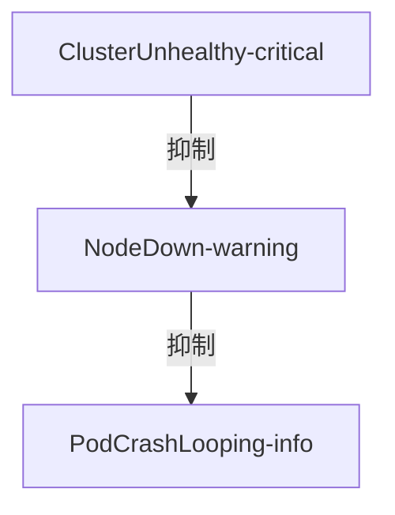

# 告警抑制策略

## 介绍

告警抑制（Alert Inhibition）是监控系统中用于减少冗余告警的关键机制。当多个相关告警同时触发时，抑制策略可以确保只有最高优先级的告警被通知，避免"告警风暴"对运维人员造成干扰。

在Grafana Loki中，告警抑制通过`alertmanager-config`文件配置，与Prometheus生态兼容。本文将逐步讲解其工作原理和实际配置方法。

## 基本概念

### 抑制规则原理
抑制规则定义了"当A告警触发时，忽略B告警"的逻辑关系。典型场景包括：

1. **层级抑制**：当集群级告警触发时，抑制所有节点级同类告警
2. **依赖抑制**：当服务A宕机导致服务B异常时，只报告根本原因(A)
3. **时间窗抑制**：在维护窗口期内临时屏蔽预期告警

:::note 抑制 vs 静默
抑制是动态规则，静默是手动临时操作。抑制更适合长期稳定的逻辑关系。
:::

## 配置方法

### 基础配置示例
以下是一个典型的抑制规则配置片段：

```yaml
inhibit_rules:
- source_match:
    alertname: NodeDown
    severity: 'critical'
  target_match:
    severity: 'warning'
  equal: ['alertname', 'cluster']
```

该规则表示：
- 当存在`severity=critical`的`NodeDown`告警时
- 抑制具有相同`alertname`和`cluster`标签的`severity=warning`告警

### 字段说明
| 字段 | 说明 |
|------|------|
| `source_match` | 触发抑制的源告警条件 |
| `target_match` | 被抑制的目标告警条件 |
| `equal` | 要求匹配的标签列表 |
| `not_equal` | 要求不匹配的标签列表 |

## 实际案例

### 案例1：Kubernetes集群抑制
```yaml
inhibit_rules:
- source_match:
    alertname: KubeAPIDown
    severity: page
  target_match_re:
    alertname: 'Kube.*|CoreDNSDown'
  equal: [namespace]
```

此规则实现：
1. 当API Server不可用(`KubeAPIDown`)时
2. 抑制同一命名空间中的所有Kubernetes组件告警
3. 因为API不可用时这些告警都是预期行为

### 案例2：多级严重度抑制


对应的配置：
```yaml
inhibit_rules:
- source_match:
    severity: 'critical'
  target_match:
    severity: 'warning'
  equal: [cluster]
- source_match:
    severity: 'warning'
  target_match:
    severity: 'info'
  equal: [node]
```

## 最佳实践

1. **标签设计**：确保相关告警具有一致的`cluster`/`namespace`等标签
2. **严重度分级**：明确定义`critical > warning > info`的抑制层级
3. **测试验证**：使用`amtool`检查抑制效果：
   ```bash
   amtool check-config alertmanager.yml
   ```

:::warning 过度抑制风险
错误的抑制规则可能导致重要告警被忽略。建议：
- 为每个抑制规则添加注释说明
- 在非生产环境充分测试
- 设置抑制超时时间
:::

## 总结

告警抑制策略能显著提升告警系统的有效性。关键要点：
- 通过`source_match`和`target_match`定义抑制条件
- 使用`equal`确保精确匹配相关实体
- 分层抑制可减少重复告警

## 延伸学习

1. [官方文档](https://grafana.com/docs/loki/latest/alerting/)
2. 练习：为你的Loki实例配置一个抑制规则，当`LogBackendDown`时抑制所有`HighLatency`告警
3. 高级话题：结合Grafana的"Alert Grouping"功能实现多维抑制