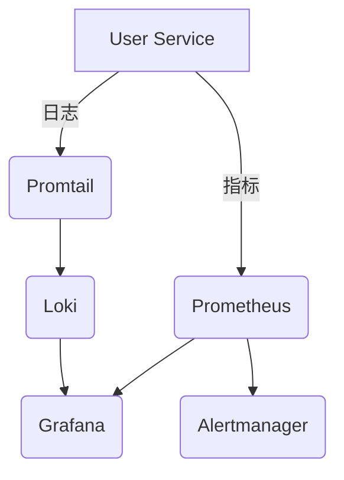

# Prometheus监控集成

## 介绍

在现代云原生环境中，监控和告警是确保系统稳定性的关键环节。Prometheus作为领先的开源监控工具，与Grafana Loki的日志管理能力结合，可以构建完整的可观测性解决方案。本章将指导初学者如何配置Prometheus与Loki的集成，实现指标和日志的联动分析。

## 核心概念

### Prometheus基础
Prometheus通过**拉取（Pull）模式**从目标服务采集指标数据，存储为时间序列，并提供强大的查询语言PromQL。其核心组件包括：
- **Prometheus Server**：主服务，负责数据采集、存储和查询
- **Exporters**：将第三方系统指标转换为Prometheus格式
- **Alertmanager**：处理告警通知

### Loki 的Promtail组件
Promtail是Loki的日志采集代理，功能类似Prometheus的Exporters，但专为日志设计：
- 自动发现目标日志文件
- 添加标签（Labels）用于高效过滤
- 通过推送（Push）模式将日志发送到Loki

## 集成配置步骤

### 1. 配置Prometheus抓取Loki指标

在Prometheus的`prometheus.yml`中添加Loki的监控目标：

```yaml
scrape_configs:
  - job_name: 'loki'
    static_configs:
      - targets: ['loki:3100'] # Loki 服务地址
```

:::tip
使用`http://loki:3100/metrics`验证Loki的指标端点是否可用
:::

### 2. 设置Promtail服务发现

Promtail需要与Prometheus相同的服务发现配置，确保日志标签与指标一致：

```yaml
scrape_configs:
  - job_name: 'myapp'
    prometheus_sd_configs:
      - targets: ['prometheus:9090'] # 复用Prometheus发现的目标
    relabel_configs:
      - source_labels: [__address__]
        target_label: instance
```

### 3. 创建告警规则

在Prometheus中定义基于日志的告警（需要Loki的logcli工具）：

```yaml
groups:
- name: log-alerts
  rules:
  - alert: HighErrorRate
    expr: rate({job="myapp"} |= "ERROR" [5m]) > 0.1
    for: 10m
    labels:
      severity: critical
    annotations:
      summary: "High error rate in {{ $labels.instance }}"
```

## 实际案例：电商平台监控

### 场景描述
监控用户服务，当出现以下情况时触发告警：
1. HTTP 500错误率超过5%
2. 登录失败日志连续出现10次

### 解决方案



1. **指标监控配置**：
```yaml
# Prometheus规则
- alert: HighHTTPError
  expr: sum(rate(http_requests_total{status=~"5.."}[1m])) by (service) / sum(rate(http_requests_total[1m])) by (service) > 0.05
```

2. **日志告警配置**：
```bash
# 使用logcli创建日志告警
logcli query --limit=10 '{job="user-service"} |~ "Login failed"' --alert="login-failures"
```

## 最佳实践

1. **标签设计**：保持Prometheus指标和Loki日志的标签一致
   ```yaml
   # 好的标签示例
   labels:
     job: "user-service"
     env: "production"
     region: "us-west"
   ```

2. **资源优化**：
   - 为高频日志流设置单独的租户
   - 使用`recording_rules`减少PromQL计算开销

3. **告警分级**：
   ```yaml
   routes:
   - receiver: 'slack-critical'
     match:
       severity: 'critical'
   - receiver: 'email-warning' 
     match:
       severity: 'warning'
   ```

## 总结

通过Prometheus与Loki的集成，我们实现了：
- 指标和日志的统一监控视图
- 基于日志内容的精确告警
- 历史数据的关联分析能力

## 延伸学习

1. **实践练习**：
   - 在本地环境部署Prometheus+Loki
   - 创建一个同时包含指标和日志的Grafana仪表板

2. **推荐资源**：
   - Prometheus官方文档：查询语言PromQL
   - Loki日志查询语法：LogQL深度解析
   - 《Monitoring with Prometheus》电子书

:::note 进阶挑战
尝试配置一个告警规则，当某个服务的错误日志突然增加300%时触发告警（需使用`compare`函数）
:::