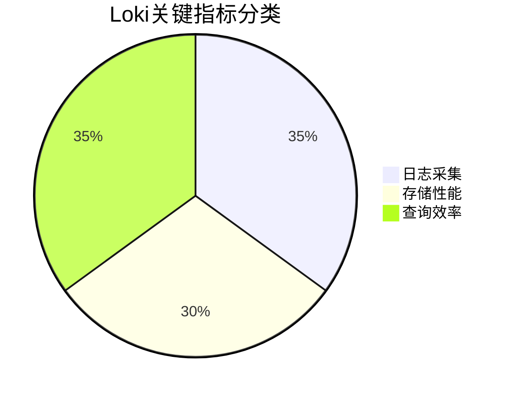

## 引言

在分布式系统中，日志监控是保障服务可靠性的关键环节。Grafana Loki作为轻量级日志聚合系统，通过监控**关键指标**（如日志吞吐量、错误率、查询延迟等），帮助开发者快速定位问题。本章将介绍如何配置和利用Loki的核心指标监控体系。

---

## 核心监控指标

Loki的关键指标分为三大类：



### 1. 日志采集指标
- `loki_distributor_bytes_received_total`: 接收的日志总字节数
- `loki_ingester_memory_chunks`: 内存中的日志块数量

:::tip 实时监控示例
通过PromQL查询最近5分钟的日志增长率：
```promql
rate(loki_distributor_bytes_received_total[5m])
```
:::

### 2. 存储性能指标
- `loki_ingester_chunk_utilization`: 日志块存储利用率
- `loki_chunk_store_stored_chunks_total`: 持久化存储的日志块数

### 3. 查询效率指标
- `loki_query_frontend_retries_total`: 查询重试次数
- `loki_query_duration_seconds`: 查询延迟分布

---

## 配置监控面板

在Grafana中创建Loki监控面板的步骤：

1. **添加Prometheus数据源**（Loki指标通过Prometheus暴露）
2. 使用以下JSON模板创建仪表盘：
```json
{
  "panels": [{
    "title": "日志吞吐量",
    "targets": [{
      "expr": "rate(loki_distributor_bytes_received_total[1m])",
      "legendFormat": "{{instance}}"
    }]
  }]
}
```

:::note 实际案例
当`loki_ingester_chunk_utilization`超过80%时触发告警，表示存储接近满载：
```yaml
# alert.rules
alert: HighChunkUtilization
expr: loki_ingester_chunk_utilization > 0.8
for: 10m
labels:
  severity: critical
annotations:
  summary: "Loki storage utilization high"
```
:::

---

## 告警策略设计

推荐的分级告警策略：

| 指标名称                  | 警告阈值 | 严重阈值 |
|---------------------------|----------|----------|
| 查询延迟(p99)             | 2s       | 5s       |
| 日志采集错误率            | 1%       | 5%       |
| 内存日志块保留时间        | 1h       | 4h       |

:::warning 注意事项
避免过度告警：建议为每个指标设置`for`持续时间（如`5m`），防止瞬时波动触发误报。
:::

---

## 总结与练习

### 关键要点
1. 监控应覆盖采集、存储、查询全链路
2. 使用PromQL表达式提取关键指标
3. 采用分级告警策略减少噪音

### 巩固练习
1. 在测试环境部署Loki，模拟高负载场景并观察指标变化
2. 创建一个检测日志采集中断的告警规则（提示：监控`loki_distributor_dropped_bytes_total`）

### 扩展阅读
- [Loki官方监控文档](https://grafana.com/docs/loki/latest/operations/monitoring/)
- 《Prometheus监控实战》第七章
