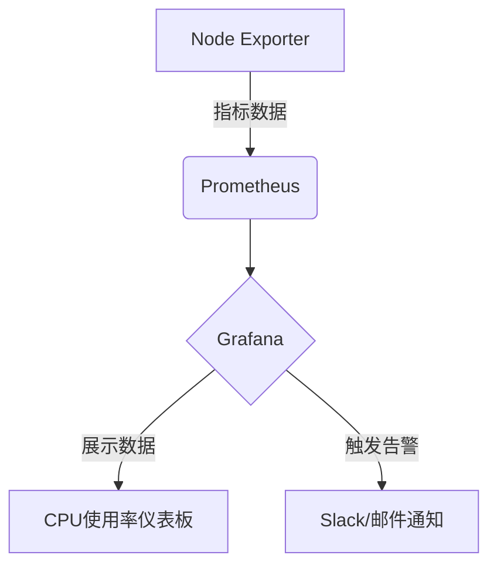

# 资源使用监控

## 介绍

资源使用监控是运维和开发中的核心实践，通过收集和分析系统资源（如CPU、内存、磁盘和网络）的指标，帮助团队及时发现性能瓶颈和潜在问题。在Grafana Loki中，虽然它本身专注于日志聚合，但可以与Prometheus等工具结合实现完整的监控方案。

## 关键监控指标

以下是需要重点关注的资源类型及其典型监控方式：

1. **CPU使用率**：监控系统负载和单个进程的CPU消耗。
2. **内存占用**：包括物理内存和交换空间的使用情况。
3. **磁盘I/O**：读写速度和磁盘空间利用率。
4. **网络流量**：带宽使用和连接数统计。

## 配置Loki与Prometheus集成

Loki通常与Prometheus搭配使用，通过以下步骤实现资源监控：

### 1. 安装Prometheus
修改Prometheus的配置文件 `prometheus.yml` 添加资源监控目标：
```yaml
scrape_configs:
  - job_name: 'node'
    static_configs:
      - targets: ['localhost:9100']  # Node Exporter默认端口
```

### 2. 部署Node Exporter
在目标机器上运行Node Exporter以收集系统指标：
```bash
wget https://github.com/prometheus/node_exporter/releases/download/v1.3.1/node_exporter-1.3.1.linux-amd64.tar.gz
tar xvfz node_exporter-*.tar.gz
cd node_exporter-* && ./node_exporter
```

### 3. 在Grafana中关联数据源
1. 添加Prometheus作为数据源
2. 导入Node Exporter仪表板（ID：1860）

## 实际案例：监控服务器CPU过载

### 场景描述
某Web服务器频繁出现响应延迟，需确认是否因CPU资源不足导致。

### 实现步骤
1. **创建告警规则**：在Prometheus中设置CPU使用率阈值
```yaml
groups:
- name: cpu-alert
  rules:
  - alert: HighCpuUsage
    expr: 100 - (avg by(instance) (irate(node_cpu_seconds_total{mode="idle"}[5m])) * 100 > 80
    for: 10m
    labels:
      severity: warning
    annotations:
      summary: "High CPU usage on {{ $labels.instance }}"
```

2. **在Grafana中可视化**：


:::tip 最佳实践
- 为生产环境设置多层阈值（如70%警告，90%严重）
- 结合日志分析（通过Loki）确认CPU高峰期的关联事件
:::

## 代码示例：查询内存使用率

通过PromQL查询最近5分钟的内存使用率：
```promql
100 * (1 - ((node_memory_MemAvailable_bytes{instance="localhost:9100"} / node_memory_MemTotal_bytes{instance="localhost:9100"})))
```

**输出结果**：
```
element | value
--------|------
local   | 68.42
```

## 总结

资源使用监控是系统健康管理的基础环节，通过Loki+Prometheus的组合可以实现：
- 实时指标采集
- 历史数据分析
- 异常自动告警

## 延伸学习

1. 官方文档：
   - [Prometheus Node Exporter](https://prometheus.io/docs/guides/node-exporter/)
   - [Grafana Alerting](https://grafana.com/docs/grafana/latest/alerting/)

2. 实践建议：
   - 在测试环境模拟高负载场景观察监控效果
   - 尝试编写自定义的PromQL查询

:::caution 注意事项
避免过度监控——只收集对业务有实际影响的指标，否则会增加系统负担和存储成本。
:::