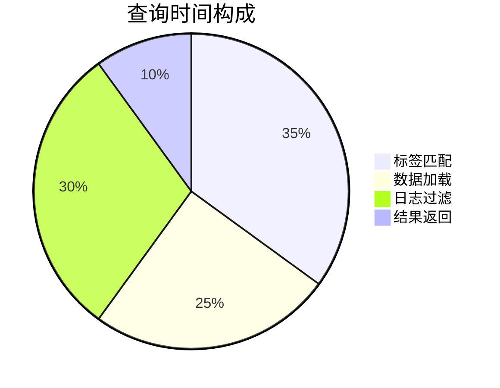

# 查询性能监控

## 介绍

查询性能监控是Grafana Loki运维中的关键环节，它能帮助您：
- 发现慢查询和资源密集型操作
- 优化LogQL查询语句
- 合理配置查询超时和限制
- 识别需要索引的日志标签

对于初学者，理解Loki的查询执行机制是性能优化的第一步。Loki不像传统数据库那样建立全文索引，而是依赖标签(label)进行高效过滤，这使得查询设计尤为重要。

## 基础监控指标

Loki提供了以下核心性能指标：

```text
loki_query_frontend_queries_total          # 查询总数
loki_query_duration_seconds               # 查询耗时分布
loki_logql_querystats_latency_seconds     # LogQL各阶段延迟
loki_process_cpu_seconds_total            # CPU使用情况
```

## 配置性能监控

### 1. 启用查询统计

在Loki配置文件中启用查询统计：

```yaml
query_range:
  stats_enabled: true
```

### 2. 示例查询分析

使用LogQL的`_stats_`字段获取查询性能数据：

```sql
{app="nginx"} |= "error" | logfmt | _stats_
```

输出示例：
```json
{
  "stats": {
    "ingester": {
      "totalChunksMatched": 12,
      "totalBatches": 3,
      "totalLinesSent": 45
    },
    "store": {
      "totalChunksRef": 15,
      "totalChunksDownloaded": 12,
      "chunkDownloadTime": 0.45
    }
  }
}
```

## 关键性能指标解读



1. **标签匹配阶段**：受标签选择器复杂度影响
2. **数据加载阶段**：取决于块(chunk)数量和存储后端性能
3. **日志过滤阶段**：与日志量和过滤条件复杂度相关

## 性能优化实践

### 案例：电商网站日志分析

**问题场景**：
用户报告订单查询接口缓慢，需要从日志中分析原因，但查询超时。

**优化方案**：

1. 先缩小时间范围定位问题时段
```sql
{app="order-service", env="production"} |= "timeout" | logfmt | line_format "{{.duration}}" 
```

2. 添加具体标签过滤
```sql
{app="order-service", route="/api/orders", status!="200"} 
```

3. 使用解析器提取结构化字段
```sql
{app="order-service"} | logfmt | duration > 2s
```

:::tip 最佳实践
- 始终从最短必要时间范围开始查询
- 优先使用标签过滤而非日志内容过滤
- 对高频查询字段考虑添加结构化标签
:::

## 告警规则配置

当查询性能下降时触发告警：

```yaml
groups:
- name: loki-query-performance
  rules:
  - alert: HighQueryLatency
    expr: rate(loki_query_duration_seconds_sum{status="200"}[5m]) / rate(loki_query_duration_seconds_count{status="200"}[5m]) > 5
    for: 10m
    labels:
      severity: warning
    annotations:
      summary: "High query latency detected"
      description: "Average query latency is {{ $value }} seconds"
```

## 总结

通过监控Loki查询性能，您可以：
✓ 及时发现系统瓶颈<br />
✓ 优化资源分配<br />
✓ 改进查询模式<br />
✓ 保障日志系统的稳定性

## 延伸学习

1. 练习：使用`_stats_`分析不同查询的性能差异
2. 尝试在Grafana中创建查询性能仪表盘
3. 阅读Loki官方文档中的[查询优化指南](https://grafana.com/docs/loki/latest/optimize/)