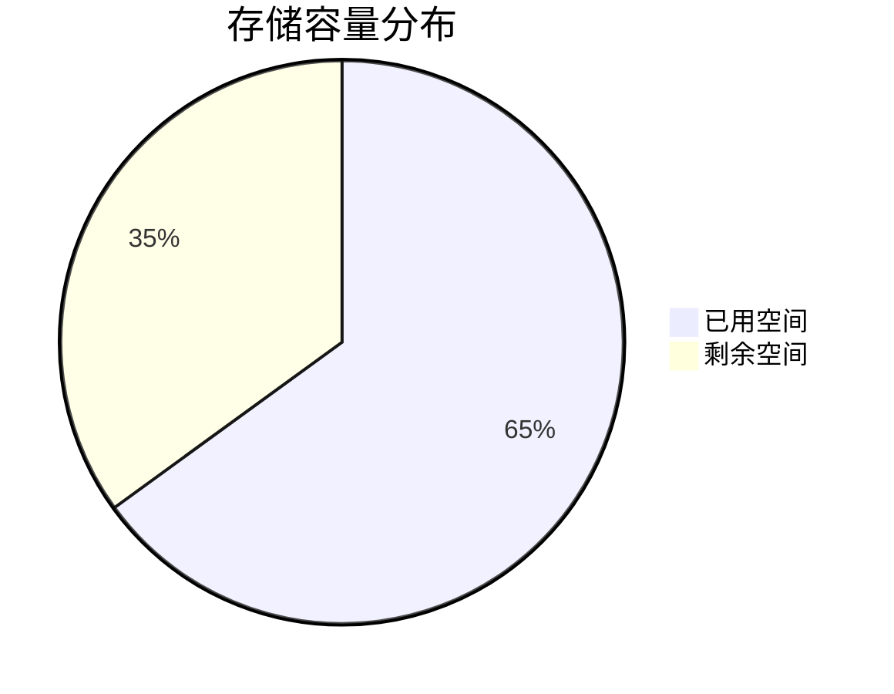

# 存储状态监控

## 介绍

存储状态监控是日志管理系统的核心功能之一，它帮助运维团队实时掌握日志存储的健康状况。在Grafana Loki中，存储状态监控主要关注以下方面：

1. **存储容量**：磁盘空间使用情况
2. **性能指标**：读写延迟、吞吐量
3. **可用性**：存储服务是否在线
4. **数据完整性**：日志是否被正确存储和索引

:::tip 为什么重要？
有效的存储监控可以：
- 预防因磁盘满导致的日志丢失
- 识别性能瓶颈
- 确保日志检索的可靠性
:::

## 关键监控指标

### 1. 存储容量监控

Loki使用对象存储(如S3、GCS)或本地文件系统存储日志数据。关键指标包括：



通过Prometheus查询示例：
```promql
sum(container_fs_usage_bytes{device=~".*loki.*"}) by (instance)
```

### 2. 性能指标

```promql
# 写入延迟
rate(loki_distributor_bytes_received_total[1m])

# 读取延迟
histogram_quantile(0.9, sum(rate(loki_query_frontend_query_duration_seconds_bucket[1m])) by (le))
```

## 配置存储监控

### 步骤1：启用Loki的/metrics端点

在Loki配置文件中添加：
```yaml
server:
  http_listen_port: 3100
  enable_metrics: true
```

### 步骤2：配置Prometheus抓取

在Prometheus配置中添加：
```yaml
scrape_configs:
  - job_name: 'loki'
    static_configs:
      - targets: ['loki:3100']
```

## 实际案例：磁盘空间告警

当Loki存储空间使用超过80%时触发告警：

```yaml
# alertmanager.yml
groups:
- name: loki-storage
  rules:
  - alert: LokiStorageRunningFull
    expr: (sum(container_fs_usage_bytes{device=~".*loki.*"}) / sum(container_fs_limit_bytes{device=~".*lobi.*"})) * 100 > 80
    for: 10m
    labels:
      severity: warning
    annotations:
      summary: "Loki storage is running full (instance {{ $labels.instance }})"
      description: "Disk usage is {{ $value }}%"
```

## 可视化监控

在Grafana中创建仪表盘，展示关键指标：

1. **存储使用率**：饼图或进度条
2. **读写吞吐量**：时间序列图
3. **错误率**：状态面板

:::note 示例查询
```promql
# 错误请求比例
sum(rate(loki_request_duration_seconds_count{status_code=~"5.."}[1m])) 
/ 
sum(rate(loki_request_duration_seconds_count[1m]))
```
:::

## 总结

存储状态监控是Loki运维的关键环节，通过本指南你学会了：
- 监控存储容量的方法
- 关键性能指标的采集
- 告警规则的配置
- 可视化监控的实现

## 延伸学习

1. **练习**：设置一个当Loki写入延迟超过500ms时触发的告警
2. **进阶阅读**：
   - [Loki官方监控文档](https://grafana.com/docs/loki/latest/operations/monitoring/)
   - [Prometheus查询指南](https://prometheus.io/docs/prometheus/latest/querying/basics/)

:::caution 注意
生产环境中建议设置存储保留策略，避免无限增长：
```yaml
table_manager:
  retention_deletes_enabled: true
  retention_period: 720h  # 30天
```
:::