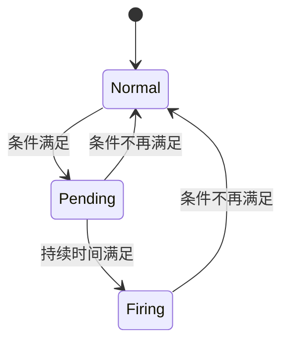

# Grafana告警规则

## 介绍

Grafana告警规则是监控系统的核心组件，它允许您定义特定条件，当这些条件被触发时，系统会发送通知。结合Loki日志分析工具，您可以创建基于日志模式的智能告警，例如检测错误率激增或特定关键字的出现。

:::tip 为什么需要告警规则？
- 自动化问题检测
- 减少人工监控成本
- 在用户发现问题前提前预警
- 基于日志内容创建上下文丰富的告警
:::

## 告警规则基础

Grafana告警规则由以下几个关键部分组成：

1. **规则名称**：描述性名称，便于识别
2. **查询表达式**：定义要监控的数据（使用LogQL查询）
3. **条件**：触发告警的阈值或模式
4. **评估时间**：检查条件的频率
5. **告警标签**：用于分类和路由的元数据
6. **告警注释**：提供上下文信息的详细描述

## 创建告警规则

### 1. 基本告警规则示例

以下是一个检测HTTP 500错误的简单告警规则：

```yaml
groups:
- name: example
  rules:
  - alert: HighErrorRate
    expr: |
      sum(rate({job="myapp"} |= "500" [5m])) by (service)
      /
      sum(rate({job="myapp"}[5m])) by (service)
      > 0.05
    for: 10m
    labels:
      severity: critical
    annotations:
      summary: "High error rate on {{ $labels.service }}"
      description: "{{ $labels.service }} has error rate of {{ $value }}"
```

### 2. 规则参数解释

- `alert`: 告警名称
- `expr`: LogQL查询表达式，计算错误率
- `for`: 持续时间，条件必须持续满足才会触发
- `labels`: 附加到告警的键值对
- `annotations`: 提供详细信息的文本模板

### 3. 告警状态生命周期



## 高级告警规则技巧

### 1. 使用模板变量

```yaml
annotations:
  description: |
    {{ $labels.job }}服务在{{ $labels.instance }}上检测到错误:
    {{ printf "value=%.2f" $value }}
    相关日志: {{ query_logs $labels $value | first | json }}
```

### 2. 多条件告警

```yaml
expr: |
  (
    sum(rate({job="myapp"} |~ "error|fail|exception" [5m])) by (service)
    /
    sum(rate({job="myapp"}[5m])) by (service)
  ) > 0.1
  AND ON() 
  (
    sum(rate({job="myapp"}[5m])) by (service)
  ) > 100
```

### 3. 预测性告警

使用预测函数提前发现问题：

```yaml
expr: |
  predict_linear(rate({job="myapp"} |~ "out of memory"[1h])[1h:], 3600) > 0
```

## 实际案例

### 案例1：Web应用监控

**场景**：监控电子商务网站的错误率和响应时间

```yaml
groups:
- name: webapp
  rules:
  - alert: HighHTTPErrorRate
    expr: |
      sum(rate({job="webapp"} |~ "HTTP/1.[01]\" [45][0-9]{2}" [5m])) by (endpoint)
      /
      sum(rate({job="webapp"}[5m])) by (endpoint)
      > 0.05
    for: 5m
    labels:
      tier: frontend
    annotations:
      action: "检查{{ $labels.endpoint }}端点"
```

### 案例2：数据库监控

**场景**：检测慢查询和连接问题

```yaml
- alert: DatabaseSlowQueries
  expr: |
    avg_over_time(
      {job="database"} 
      | json 
      | duration > 1s 
      | line_format "{{ .duration }}" 
      | unwrap duration [5m]
    ) by (query_type) > 2
  for: 15m
  annotations:
    impact: "{{ $labels.query_type }}查询平均响应时间超过2秒"
```

## 最佳实践

1. **合理的阈值**：基于历史数据设置阈值
2. **分级告警**：区分警告(warning)和严重(critical)级别
3. **避免告警风暴**：设置适当的`for`持续时间
4. **清晰的注释**：提供可操作的修复建议
5. **测试规则**：使用Grafana Explore验证查询

:::caution 常见错误
- 过于频繁的评估间隔导致系统负载
- 缺少`for`字段导致瞬时波动触发告警
- 模板变量未正确处理导致信息不全
:::

## 总结

Grafana告警规则是构建强大监控系统的关键。通过结合Loki的日志分析能力和Grafana的告警功能，您可以创建基于实际应用日志的智能监控系统。记住从简单规则开始，逐步完善您的告警策略。

## 进一步学习

1. 尝试为您的应用创建一个检测关键错误的告警规则
2. 探索Grafana的告警分组和静默功能
3. 学习如何使用告警模板创建更友好的通知
4. 实践将告警路由到不同渠道(邮件、Slack等)

:::note 资源推荐
- [Grafana官方告警文档](https://grafana.com/docs/grafana/latest/alerting/)
- [LogQL查询参考](https://grafana.com/docs/loki/latest/logql/)
- [告警规则示例库](https://github.com/grafana/alerting-examples)
:::