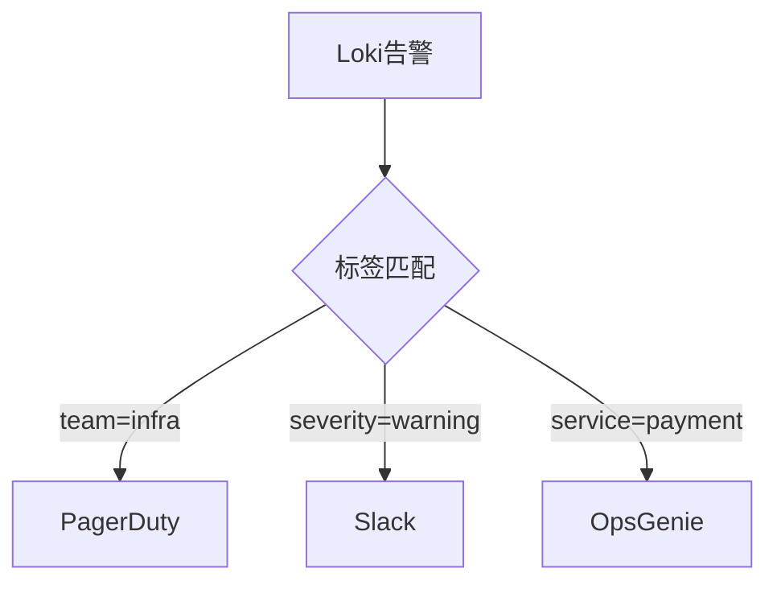

# LogQL告警配置

## 介绍

LogQL是Grafana Loki专用的日志查询语言，类似于Prometheus的PromQL。通过LogQL告警规则，您可以基于日志内容触发告警，例如检测错误率激增、异常模式或安全事件。本指南将带您逐步掌握告警配置的核心方法。

:::note 关键概念
- **告警规则**：定义触发条件和告警消息的YAML配置
- **LogQL表达式**：用于筛选和计算日志指标的查询语句
- **告警路由**：决定告警发送到哪个通知渠道
:::

## 基础告警配置

### 1. 告警规则文件结构

Loki使用与Prometheus相同的告警规则格式，通常存储在`rules.yml`中：

```yaml
groups:
- name: example
  rules:
  - alert: HighErrorRate
    expr: |
      rate({job="myapp"} |= "error" [5m]) * 100
      /
      rate({job="myapp"}[5m]) > 5
    for: 10m
    labels:
      severity: critical
    annotations:
      summary: "High error rate on {{ $labels.job }}"
      description: "Error rate is {{ $value }}%"
```

### 2. 核心字段解析

| 字段 | 必填 | 说明 |
|------|------|------|
| `alert` | 是 | 告警名称（需唯一） |
| `expr` | 是 | LogQL表达式 |
| `for` | 否 | 持续时间（触发前需满足条件的时长） |
| `labels` | 否 | 附加标签 |
| `annotations` | 否 | 告警详情模板 |

### 3. 常用LogQL告警模式

#### 错误计数告警
```yaml
expr: count_over_time({namespace="prod"} |= "ERROR" [5m]) > 10
```

#### 速率告警
```yaml
expr: rate({job="api"} |~ "timeout" [1m]) > 5
```

#### 比率告警
```yaml
expr: 
  sum(rate({app="frontend"} |~ "500" [5m]))
  /
  sum(rate({app="frontend"}[5m])) > 0.05
```

## 实战案例

### 案例1：Web应用错误率监控

```yaml
groups:
- name: webapp
  rules:
  - alert: WebAppErrorRate
    expr: |
      sum(rate({app="webserver"} | json | status >= 500 [5m]))
      /
      sum(rate({app="webserver"}[5m])) > 0.1
    for: 15m
    labels:
      team: frontend
    annotations:
      dashboard: "https://grafana.example.com/d/webapp-metrics"
```

### 案例2：认证失败暴增检测

```yaml
- alert: AuthFailureSpike
  expr: |
    count_over_time(
      {cluster="us-east1"} 
      |~ "authentication failed" 
      | pattern `<ip> <user> <method> "<path>" <status>` 
      [1m]
    ) > 20
  annotations:
    runbook: "/runbooks/auth-failures.md"
```

## 高级配置技巧

### 1. 多租户告警路由



### 2. 告警抑制规则

防止重复告警：
```yaml
inhibit_rules:
- source_match:
    alertname: NodeDown
  target_match:
    severity: critical
  equal:
    - node
```

## 测试与验证

使用`logcli`工具测试告警表达式：
```bash
logcli query --stats 'rate({job="nginx"} |= "500" [5m])'
```

## 总结

通过LogQL告警配置，您可以：
- 实时监控日志异常模式
- 基于业务指标创建智能告警
- 通过标签系统实现精细路由

:::tip 练习建议
1. 为您的应用创建一个错误率告警
2. 测试包含`for`延迟的告警触发
3. 配置不同严重级别的通知渠道
:::

## 延伸阅读

- [官方LogQL文档](https://grafana.com/docs/loki/latest/logql/)
- [Prometheus告警最佳实践](https://prometheus.io/docs/practices/alerting/)
- [Loki告警管理视频教程](https://grafana.com/tutorials/loki-alerting)