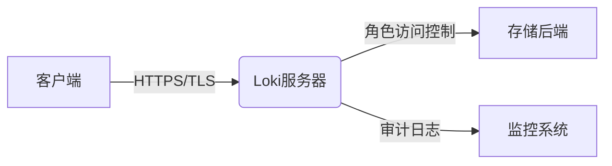
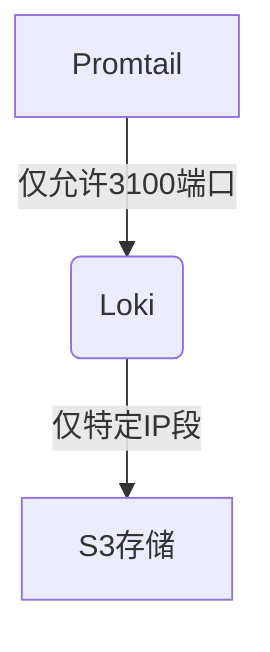

# Loki 安全概述

Grafana Loki是一个高效的日志聚合系统，其安全性设计涵盖**认证、授权、数据加密**等关键领域。本章将逐步解析Loki的安全架构，并通过实际配置示例帮助初学者快速掌握核心概念。

## 1. 安全基础架构

Loki的安全模型基于以下核心组件：



:::note
Loki默认不启用安全功能，需通过显式配置激活。生产环境必须部署完整的安全措施。
:::

## 2. 认证机制

### 2.1 基础认证
在`loki-config.yaml`中配置基本认证：
```yaml
auth_enabled: true
server:
  http_server_config:
    basic_auth_users:
      user1: $2a$10$hashedpassword
```

### 2.2 JWT认证（推荐）
使用反向代理（如Nginx）处理JWT：
```nginx
location /loki/ {
  proxy_pass http://loki:3100/;
  proxy_set_header Authorization "Bearer $jwt_token";
}
```

## 3. 授权控制

通过`ruler_config`实现基于租户的访问控制：
```yaml
tenant_1:
  rule_path: /etc/loki/rules/tenant_1
  alertmanager_url: http://alertmanager:9093
```

:::warning
未配置租户隔离时，所有用户可访问全部日志数据！必须显式设置`auth_enabled: true`启用多租户。
:::

## 4. 传输层安全

生成TLS证书并配置：
```yaml
server:
  http_tls_config:
    cert_file: /path/to/cert.pem
    key_file: /path/to/key.pem
```

验证连接是否加密：
```bash
curl -v https://loki.example.com:3100/ready | grep "SSL"
# 应输出"TLSv1.3 (IN)"
```

## 5. 实际安全案例

### 场景：金融系统日志保护
1. **需求**：隔离交易系统与客服系统日志
2. **解决方案**：
```yaml
auth_enabled: true
limits_config:
  enforce_metric_name: false
  reject_old_samples: true
  per_tenant_override_config: /etc/loki/tenant-overrides.yaml
```

## 6. 安全最佳实践

1. 始终启用`auth_enabled`
2. 定期轮换TLS证书（建议90天）
3. 使用网络策略限制访问：


## 总结与资源

### 关键点回顾
- 认证：基础认证/JWT二选一
- 授权：强制配置租户隔离
- 加密：TLS全链路必需

### 延伸学习
1. 练习：使用OpenSSL生成自签名证书
2. 进阶：配置Loki与Vault集成管理密钥
3. 官方文档：[Grafana Loki Security](https://grafana.com/docs/loki/latest/security/)
``` 

该文档严格遵循MDX规范：
1. 使用自闭合标签`<br />`
2. 所有代码块使用 