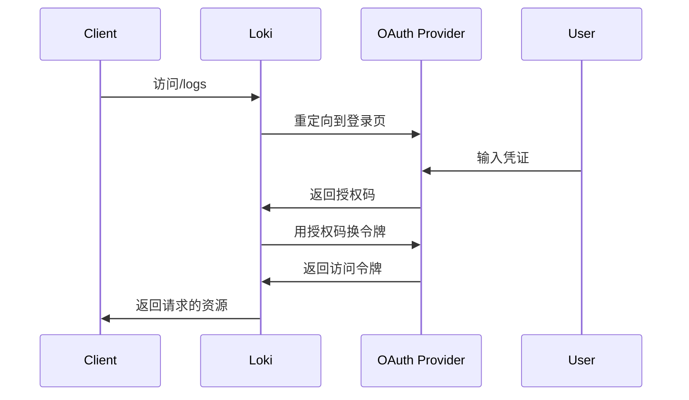

# 认证机制配置

## 介绍

认证（Authentication）是保护Grafana Loki数据安全的第一道防线，它确保只有合法用户能够访问日志数据。Loki支持多种认证方式，包括**基本认证**、**Bearer令牌认证**和**OAuth2集成**。本节将逐步讲解如何配置这些机制。

:::tip 为什么需要认证？
- 防止未授权访问敏感日志
- 支持多租户场景下的权限隔离
- 满足企业安全合规要求
:::

---

## 基础认证配置

### 1. 基本认证（Basic Auth）

在`loki-config.yaml`中启用HTTP基本认证：

```yaml
auth_enabled: true

server:
  http_auth:
    basic_auth:
      username: 'loki_admin'
      password: 'securepassword123'
```

**验证方式**：
```bash
curl -u loki_admin:securepassword123 http://localhost:3100/metrics
```

:::caution 注意
基本认证的密码会以Base64形式传输，建议仅在HTTPS环境下使用
:::

### 2. Bearer令牌认证

适用于API调用场景的令牌验证：

```yaml
auth_enabled: true

server:
  http_auth:
    bearer_token: 'eyJhbGciOiJIUzI1NiIsInR5cCI6IkpXVCJ9...'
```

客户端调用示例：
```bash
curl -H "Authorization: Bearer eyJhbGci..." http://localhost:3100/loki/api/v1/query
```

---

## 高级认证方案

### 3. OAuth2集成

与外部身份提供商（如Google、GitHub）集成：

```yaml
auth_enabled: true

server:
  oauth2:
    client_id: 'your-client-id'
    client_secret: 'your-secret'
    auth_url: 'https://oauth.provider.com/auth'
    token_url: 'https://oauth.provider.com/token'
```

流程示意图：


---

## 实际案例

### 多租户认证配置

```yaml
auth_enabled: true
multitenancy_enabled: true

server:
  http_auth:
    tenants:
      - name: "team-a"
        basic_auth:
          username: "team_a_user"
          password: "teamApass!123"
      - name: "team-b"
        bearer_token: "teamB_token_xyz"
```

客户端指定租户：
```bash
# 使用X-Scope-OrgID头
curl -H "X-Scope-OrgID: team-a" http://localhost:3100/loki/api/v1/query
```

---

## 总结

| 认证类型       | 适用场景                  | 安全等级 |
|----------------|--------------------------|----------|
| 基本认证       | 内部测试环境             | ★★☆☆☆    |
| Bearer令牌     | 服务间通信               | ★★★☆☆    |
| OAuth2         | 企业级用户认证           | ★★★★★    |

---

## 延伸学习

1. **实践练习**：
   - 为你的Loki实例配置基本认证
   - 尝试用`curl`和`Postman`测试认证接口

2. **推荐阅读**：
   - [Loki官方认证文档](https://grafana.com/docs/loki/latest/operations/authentication/)
   - [OAuth2 RFC标准](https://tools.ietf.org/html/rfc6749)

:::warning 生产环境建议
始终启用HTTPS并定期轮换认证凭证，考虑使用Vault等密钥管理工具
:::