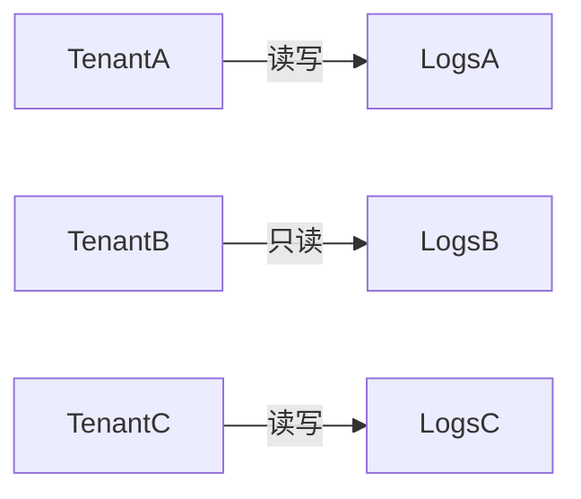

# 权限最小化原则

权限最小化原则（Principle of Least Privilege, PoLP）是信息安全领域的核心概念之一。它要求系统或用户仅被授予完成其任务所需的最小权限，而非过度授权。在Grafana Loki中，这一原则能有效降低数据泄露或误操作的风险。

## 为什么需要权限最小化？

1. **减少攻击面**：限制权限可降低恶意用户或程序利用漏洞的可能性。<br />
2. **防止误操作**：避免因过高权限导致意外删除或修改关键数据。<br />
3. **合规性要求**：许多行业标准（如GDPR）明确要求权限最小化。

:::tip 类比理解
想象你住在一栋公寓里：物业管理员拥有所有房间的钥匙（完全权限），而保洁人员只有公共区域的钥匙（最小权限）。这样即使保洁人员的钥匙丢失，也不会威胁到住户的私人空间。
:::

## 在Grafana Loki中的实现

### 1. 角色与权限分配

Loki通过`roles`和`permissions`实现权限控制。以下是一个典型的权限配置示例：

```yaml
# loki-config.yaml
auth_enabled: true

auth:
  roles:
    reader:
      permissions: [logs.read]
    writer:
      permissions: [logs.write, logs.read]
    admin:
      permissions: [logs.read, logs.write, config.update]
```

**输入**：定义三个角色（reader/writer/admin）<br />
**输出**：不同角色拥有逐步增加的权限层级。

### 2. 用户绑定最小角色

```yaml
# 用户绑定示例
users:
  - username: "reporting_bot"
    roles: ["reader"]  # 仅需读取日志
  - username: "ci_pipeline"
    roles: ["writer"]  # 需要写入日志
```

:::caution 常见错误
不要因为临时需求而赋予`admin`角色。例如，CI流水线通常只需要`writer`而非`admin`权限。
:::

### 3. 租户隔离

Loki的多租户特性天然支持权限隔离。每个租户的数据完全独立：



## 实际案例：电商平台监控

**场景**：一个电商平台使用Loki存储三类日志：
1. 订单服务日志（敏感）
2. 前端性能日志（非敏感）
3. 安全审计日志（高度敏感）

**权限设计方案**：
```yaml
roles:
  frontend_team:
    permissions: [logs.read]
    allowed_tenants: ["frontend"]
  order_team:
    permissions: [logs.read]
    allowed_tenants: ["orders"]
  security:
    permissions: [logs.read, logs.write]
    allowed_tenants: ["audit"]
```

**效果**：
- 安全团队无法访问订单日志
- 前端团队无法看到审计日志
- 订单团队只能读取自己的日志

## 验证权限配置

使用`logcli`测试权限是否生效：

```bash
# 以frontend_team身份尝试读取订单日志（应失败）
logcli --username=frontend_team --tenant=orders query '{job="order-service"}'
```

**预期输出**：
```
Error: 403 Forbidden
```

## 总结

权限最小化原则的实施步骤：
1. 明确每个用户/系统的实际需求
2. 创建细粒度的角色和权限
3. 使用租户隔离敏感数据
4. 定期审计权限分配

## 延伸练习

1. 在测试环境中创建一个只能查询特定标签（如`env=staging`）的角色<br />
2. 尝试通过`logcli`和Grafana界面验证权限限制<br />
3. 设计一个违反PoLP的配置，并观察潜在风险

:::note 附加资源
- [Loki官方文档 - 认证与授权](https://grafana.com/docs/loki/latest/operations/authentication/)
- NIST特别出版物800-53（权限控制标准）
:::