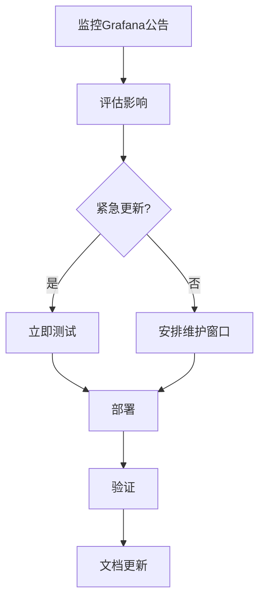

# 安全更新策略

## 介绍

安全更新策略是维护Grafana Loki系统安全性的核心实践。它涉及定期更新Loki及其依赖组件，以修复已知漏洞、增强功能并保持与生态系统的兼容性。对于初学者来说，理解如何规划、测试和部署这些更新至关重要，尤其是在生产环境中。

## 为什么需要安全更新？

1. **漏洞修复**：新发现的漏洞可能被攻击者利用。
2. **功能增强**：更新可能包含改进的安全功能。
3. **合规要求**：某些行业标准要求定期更新。

:::tip
即使你的Loki实例运行正常，也应定期检查更新——安全漏洞可能尚未被发现或利用。
:::

## 更新策略的关键组成部分

### 1. 版本跟踪

使用以下命令检查当前Loki版本：
```bash
loki --version
```
示例输出：
```
loki, version 2.8.0 (branch: HEAD, revision: abc123)
```

### 2. 更新分类

| 更新类型 | 响应时间 | 测试要求 |
|---------|----------|----------|
| 紧急安全补丁 | 24小时内 | 基本冒烟测试 |
| 常规安全更新 | 1周内 | 完整回归测试 |
| 功能更新 | 按计划 | 全面测试 |

### 3. 更新流程



## 实际案例：处理CVE-2023-XXXXX

假设Grafana发布了一个关于Loki查询注入漏洞的公告：

1. **影响评估**：
   - 漏洞允许通过特定LogQL查询执行未授权操作
   - 影响版本：2.7.0至2.7.3

2. **行动步骤**：
   ```bash
   # 检查受影响组件
   curl -s localhost:3100/loki/api/v1/status/buildinfo | jq .version
   ```

3. **更新操作**：
   ```bash
   # 使用Docker更新的示例
   docker pull grafana/loki:2.7.4
   docker-compose down
   docker-compose up -d
   ```

4. **验证**：
   ```bash
   # 确认新版本运行
   curl -s localhost:3100/ready | grep ready
   ```

## 最佳实践

1. **测试环境先行**：
   - 始终先在非生产环境测试更新
   - 使用真实日志样本验证功能

2. **回滚计划**：
   ```bash
   # 保留旧版本二进制文件
   cp /usr/bin/loki /backup/loki_$(date +%F)
   ```

3. **自动化检查**：
   使用如下Prometheus规则监控版本：
   ```yaml
   - alert: LokiUpdateAvailable
     expr: loki_build_info{version!="2.8.0"}
     for: 1h
     labels:
       severity: warning
     annotations:
       summary: "Loki update available (current {{ $labels.version }})"
   ```

## 总结

有效的安全更新策略应包含：
- 定期监控更新公告
- 清晰的影响评估流程
- 分阶段部署计划
- 全面的测试和验证
- 详细的文档记录

## 扩展资源

1. 订阅[Grafana安全公告](https://grafana.com/security)
2. 练习：设置一个监控规则，当Loki版本落后最新稳定版超过2个次版本时触发警报
3. 研究：了解语义化版本控制(SemVer)如何应用于Loki版本号

:::caution
永远不要在生产环境直接运行`apt-get upgrade`或类似命令而不先检查变更日志。某些系统包可能与Loki有依赖关系。
:::