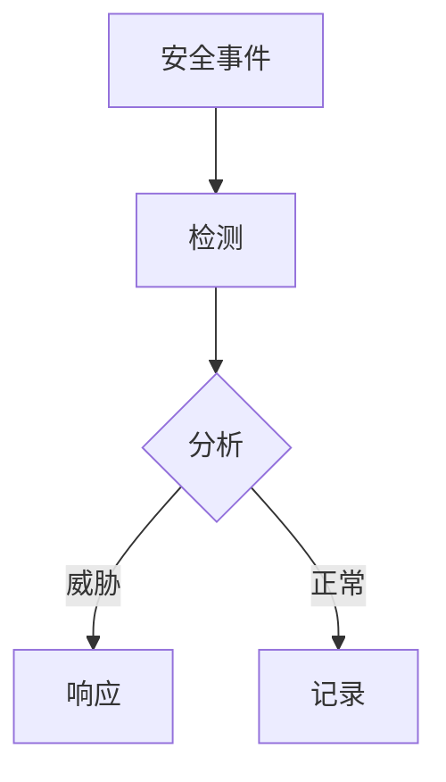

# 安全最佳实践

在当今的数字化环境中，安全性是任何系统设计的核心部分。Grafana Loki作为一个日志聚合系统，存储了大量敏感信息，因此确保其安全性至关重要。本文将介绍保护Loki部署的关键安全最佳实践，适合初学者理解和实施。

## 介绍

Grafana Loki是一个水平可扩展、高可用的多租户日志聚合系统，通常用于存储和查询大量日志数据。由于其处理的数据可能包含敏感信息，因此必须采取适当的安全措施来防止未经授权的访问、数据泄露和其他安全威胁。

## 认证与授权

### 1. 启用身份验证

Loki本身不提供内置的身份验证机制，但可以与外部服务（如Grafana、Prometheus或OpenID Connect提供者）集成来实现认证。

**示例：使用Grafana进行认证**
```yaml
# grafana.ini
[auth]
enable = true
```

### 2. 实施基于角色的访问控制（RBAC）

通过RBAC，你可以控制不同用户或服务账户对Loki数据的访问权限。

**示例：Loki的RBAC配置**
```yaml
# loki-config.yaml
auth_enabled: true
```

## 网络安全性

### 1. 使用TLS加密通信

所有Loki组件之间的通信应使用TLS加密。

**示例：配置Loki使用TLS**
```yaml
# loki-config.yaml
server:
  http_tls_config:
    cert_file: /path/to/cert.pem
    key_file: /path/to/key.pem
```

### 2. 网络隔离

将Loki部署在专用网络或VPC中，限制外部访问。

## 数据安全

### 1. 日志数据加密

对于敏感日志数据，考虑在存储前进行加密。

**示例：使用客户端加密**
```go
// 伪代码示例
encryptedLogs := encryptAES(logData, encryptionKey)
```

### 2. 保留策略

设置适当的日志保留策略，避免无限期存储敏感数据。

**示例：配置保留时间**
```yaml
# loki-config.yaml
limits_config:
  retention_period: 720h # 30天
```

## 实际案例：电子商务平台的安全部署

一个电子商务平台使用Loki来存储用户活动日志、交易日志和系统日志。他们实施了以下安全措施：

1. 通过Grafana集成OpenID Connect进行用户认证
2. 为不同团队（开发、运维、安全）设置不同的访问权限
3. 所有内部通信使用mTLS
4. 敏感字段（如信用卡号）在摄入前被标记化
5. 交易日志保留7天，系统日志保留30天

## 监控与审计

### 1. 记录安全事件

确保记录所有身份验证尝试和配置更改。

### 2. 定期审计

定期检查：
- 用户权限
- 访问模式
- 配置变更历史



## 总结

保护Grafana Loki部署需要多层次的安全措施：
1. 强身份验证和精细授权
2. 网络通信加密
3. 数据加密和适当保留
4. 持续监控和定期审计

:::tip 练习
1. 在你的测试环境中配置Loki使用TLS
2. 创建一个RBAC策略，限制开发团队只能访问特定命名空间的日志
3. 设置一个保留策略，自动删除超过14天的日志
:::

## 附加资源

- [Loki官方文档 - 安全](https://grafana.com/docs/loki/latest/security/)
- [OpenID Connect规范](https://openid.net/connect/)
- [TLS最佳实践指南](https://cheatsheetseries.owasp.org/cheatsheets/TLS_Cheat_Sheet.html)