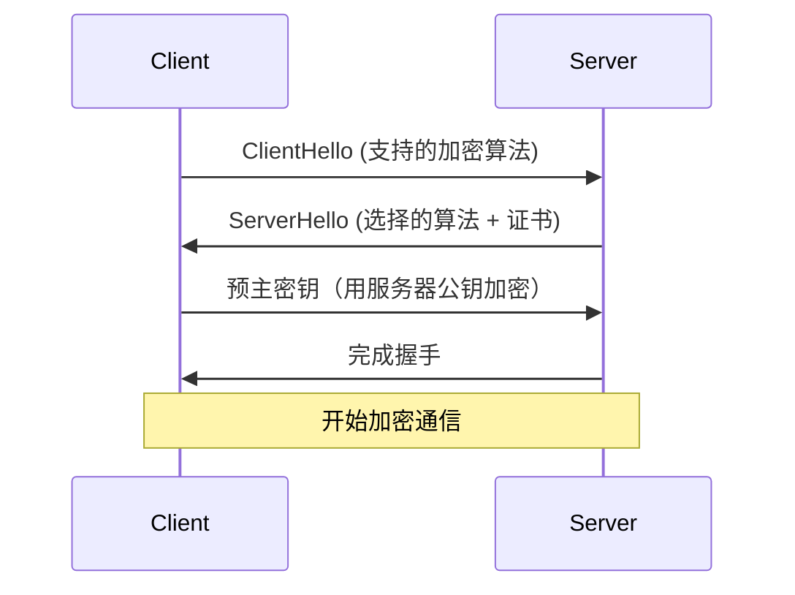

# TLS/SSL配置

## 介绍

TLS（Transport Layer Security）和SSL（Secure Sockets Layer）是用于加密网络通信的协议。在Grafana Loki中配置TLS/SSL可以确保数据在传输过程中不被窃取或篡改，尤其适用于生产环境。本文将指导你如何为Loki的组件（如Promtail、Loki服务器）启用TLS/SSL。

:::note
SSL是TLS的前身，现代系统通常使用TLS。术语"SSL"仍被广泛使用，但实际指的是TLS。
:::

---

## 基础概念

### TLS/SSL如何工作？
1. **握手阶段**：客户端和服务器协商加密算法并交换密钥。
2. **加密通信**：使用协商的密钥加密数据传输。
3. **证书验证**：客户端验证服务器证书的真实性（可选客户端证书验证）。



---

## 配置步骤

### 1. 生成证书
使用OpenSSL生成自签名证书（仅用于测试环境）：
```bash
# 生成私钥和证书
openssl req -x509 -newkey rsa:4096 -keyout key.pem -out cert.pem -days 365 -nodes
```

### 2. Loki服务器配置
在Loki的配置文件（`loki-config.yaml`）中启用TLS：
```yaml
server:
  http_listen_port: 3100
  grpc_listen_port: 9095
  http_tls_config:
    cert_file: /path/to/cert.pem
    key_file: /path/to/key.pem
```

### 3. Promtail客户端配置
确保Promtail通过HTTPS连接到Loki：
```yaml
clients:
  - url: https://loki.example.com:3100/loki/api/v1/push
    tls_config:
      ca_file: /path/to/ca.pem  # 证书颁发机构(CA)的证书
```

:::warning
自签名证书需手动分发CA证书到所有客户端。生产环境应使用受信任的CA（如Let's Encrypt）。
:::

---

## 实际案例

### 场景：保护Promtail到Loki的日志传输
1. **需求**：防止内网日志被嗅探。
2. **解决方案**：
   - 为Loki服务器配置TLS。
   - 在Promtail中指定HTTPS端点并验证证书。

```yaml
# Promtail配置片段
clients:
  - url: https://loki-secure.internal:3100/loki/api/v1/push
    tls_config:
      ca_file: /etc/ssl/company-ca.pem
      server_name: loki-secure.internal  # SNI（服务器名称指示）
```

---

## 高级选项

### 双向TLS（mTLS）
要求客户端也提供证书，增强安全性：
```yaml
# Loki 服务器配置
http_tls_config:
  cert_file: /path/to/cert.pem
  key_file: /path/to/key.pem
  client_auth_type: RequireAndVerifyClientCert
  client_ca_file: /path/to/client-ca.pem
```

---

## 总结

- TLS/SSL是保护Loki网络通信的关键。
- 生产环境应使用可信CA签名的证书。
- 双向TLS（mTLS）适用于高安全需求场景。

## 延伸阅读
- [OpenSSL官方文档](https://www.openssl.org/docs/)
- [Let's Encrypt免费证书](https://letsencrypt.org/)
- [Grafana TLS配置指南](https://grafana.com/docs/grafana/latest/setup-grafana/configure-security/)

## 练习
1. 使用OpenSSL生成自签名证书并在本地Loki实例启用TLS。
2. 配置Promtail通过HTTPS推送日志，捕获并分析握手失败的错误。