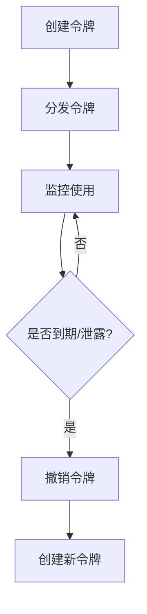

# API令牌管理

## 介绍

API令牌是Grafana Loki中用于身份验证和授权的核心机制。它们允许应用程序或用户通过API与Loki交互，而无需直接使用用户名和密码。良好的令牌管理实践能有效防止未授权访问和数据泄露。

:::note 关键概念
- **令牌作用域**：定义令牌的访问权限（如只读、读写）
- **过期时间**：限制令牌的有效期
- **轮换策略**：定期更换令牌以降低风险
:::

## 令牌类型

Grafana Loki支持两种主要令牌类型：

1. **用户API令牌**：用于个人用户访问
2. **服务账户令牌**：用于机器间通信

## 创建API令牌

### 通过Grafana界面创建

1. 登录Grafana，导航至`Configuration > API Keys`
2. 点击`Add API Key`按钮
3. 填写名称、角色和过期时间

### 通过CLI创建（企业版）

```bash
# 使用logcli创建令牌
logcli api-keys create \
  --name="monitoring-app" \
  --role=Reader \
  --ttl=720h
```

输出示例：
```
API Key created: glsa_xyz1234567890
```

:::warning 安全提示
创建后立即复制令牌，因为它不会再次显示。建议存储在密码管理器中。
:::

## 令牌生命周期管理



## 最佳实践

1. **最小权限原则**：
   ```bash
   # 错误示范 - 授予过多权限
   logcli api-keys create --name="readonly-app" --role=Admin

   # 正确示范 - 精确授权
   logcli api-keys create --name="readonly-app" --role=Reader
   ```

2. **定期轮换**：
   - 生产环境建议每月轮换
   - 安全事件后立即轮换

3. **安全存储**：
   - 使用Kubernetes Secrets或Vault等专用工具
   - 禁止硬编码在源代码中

## 实际案例：监控应用集成

假设我们需要为监控系统配置Loki访问：

1. 创建只读令牌：
   ```bash
   logcli api-keys create \
     --name="prometheus-export" \
     --role=Reader \
     --ttl=8760h  # 1年有效期
   ```

2. 在Prometheus配置中使用：
   ```yaml
   scrape_configs:
     - job_name: 'loki'
       static_configs:
         - targets: ['loki:3100']
       bearer_token: 'glsa_xyz1234567890'
   ```

3. 设置监控告警规则，检测异常令牌使用

## 故障排除

常见问题及解决方案：

| 问题 | 可能原因 | 解决方法 |
|------|----------|----------|
| 401 Unauthorized | 令牌过期 | 创建新令牌并更新配置 |
| 403 Forbidden | 权限不足 | 检查令牌角色范围 |
| 频繁认证失败 | 令牌泄露 | 立即撤销并调查 |

## 总结

API令牌管理是Loki安全架构的重要组成部分。通过：
- 严格控制令牌权限
- 实施定期轮换策略
- 采用安全存储方案
可以有效降低系统安全风险。

## 延伸学习

1. 练习：使用`logcli`创建并测试不同权限的令牌
2. 进阶阅读：
   - [Loki官方文档 - 安全模型](https://grafana.com/docs/loki/latest/security/)
   - [OWASP API安全指南](https://cheatsheetseries.owasp.org/cheatsheets/REST_Security_Cheat_Sheet.html)

:::tip 小测验
尝试回答：
1. 为什么不应该使用长期有效的Admin令牌？
2. 如何检测某个令牌是否被泄露？
:::