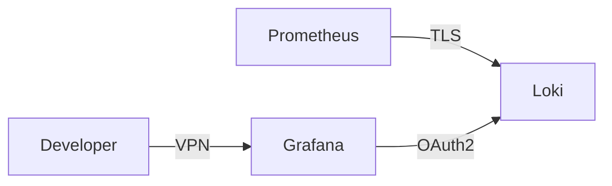

# 网络安全策略

## 介绍

网络安全策略是保护Grafana Loki和其他系统免受恶意攻击和数据泄露的关键措施。对于初学者来说，理解这些策略的基本原理和实施方法至关重要。本章将介绍常见的网络安全策略，并展示如何在Loki环境中应用它们。

## 基础概念

### 1. 认证与授权

认证（Authentication）是验证用户身份的过程，而授权（Authorization）则确定用户有权访问哪些资源。在Loki中，可以通过以下方式实现：

```yaml
# Loki 配置示例 - 启用基本认证
auth_enabled: true
```

### 2. 传输层安全（TLS）

TLS加密客户端和服务器之间的通信，防止数据被窃听。配置Loki使用HTTPS：

```yaml
server:
  http_listen_port: 3100
  https_listen_port: 8443
  tls_cert_path: /path/to/cert.pem
  tls_key_path: /path/to/key.pem
```

### 3. 网络隔离

使用防火墙规则限制对Loki的访问：

```bash
# 只允许特定IP访问3100端口
iptables -A INPUT -p tcp --dport 3100 -s 192.168.1.100 -j ACCEPT
iptables -A INPUT -p tcp --dport 3100 -j DROP
```

## 实际案例

### 场景：保护生产环境中的Loki

1. **问题**：你的Loki实例暴露在公网，需要防止未授权访问。
2. **解决方案**：
   - 启用双向TLS认证
   - 配置基于角色的访问控制（RBAC）
   - 设置网络策略只允许Prometheus服务器连接



## 进阶策略

### 1. 审计日志

记录所有对Loki的访问尝试：

```yaml
audit:
  enabled: true
  path: /var/log/loki/audit.log
```

### 2. 速率限制

防止DoS攻击：

```yaml
limits_config:
  ingestion_rate_mb: 10
  ingestion_burst_size_mb: 20
```

:::tip 最佳实践
- 定期轮换TLS证书
- 使用秘密管理工具（如Vault）存储凭证
- 启用多因素认证（MFA）访问管理界面
:::

## 总结

实施有效的网络安全策略需要多层次的方法：
1. 保护通信渠道（TLS）
2. 控制访问（认证/授权）
3. 监控异常活动（审计日志）

## 附加资源

1. [Loki官方安全文档](https://grafana.com/docs/loki/latest/security/)
2. [OWASP网络安全指南](https://owasp.org/www-project-top-ten/)
3. 练习：配置Loki使用Let's Encrypt证书