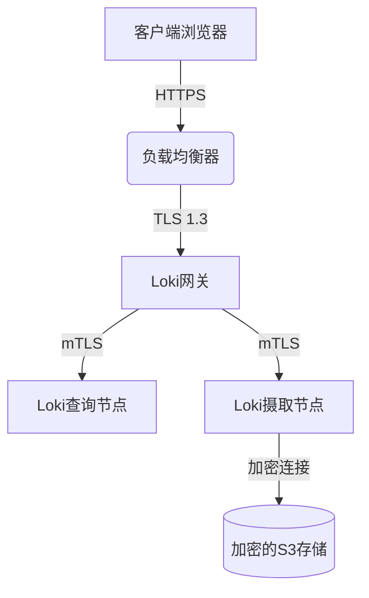

# 数据加密选项

在当今数字化世界中，数据安全至关重要。Grafana Loki作为日志聚合系统，提供了多种数据加密选项来保护您的日志数据免受未经授权的访问。本章将介绍Loki中的数据加密机制，包括传输层加密(TLS)和静态数据加密，帮助您构建更安全的日志管理系统。

## 为什么需要数据加密？

日志数据通常包含敏感信息，如用户凭证、IP地址和系统配置。如果这些数据在传输或存储过程中被截获，可能会导致严重的安全问题。数据加密通过以下方式保护您的日志：

1. **机密性**：确保只有授权方可以访问数据
2. **完整性**：防止数据在传输过程中被篡改
3. **身份验证**：验证通信双方的身份

## 传输层加密(TLS)

TLS(Transport Layer Security)是保护数据在网络上传输的主要协议。在Loki中，您可以为以下组件配置TLS：

### 配置Loki服务器的TLS

要为Loki服务器启用HTTPS，您需要在配置文件中添加TLS设置：

```yaml
server:
  http_listen_port: 3100
  grpc_listen_port: 9095
  http_tls_config:
    cert_file: /path/to/cert.pem
    key_file: /path/to/key.pem
```

### 配置Promtail的TLS

Promtail(日志收集代理)也需要配置TLS以安全地将日志发送到Loki：

```yaml
clients:
  - url: https://loki.example.com:3100/loki/api/v1/push
    tls_config:
      ca_file: /path/to/ca.pem
      cert_file: /path/to/client-cert.pem
      key_file: /path/to/client-key.pem
      server_name: loki.example.com
```

:::note
您可以使用工具如`openssl`或`certbot`生成自签名证书进行测试，但在生产环境中应使用受信任的证书颁发机构(CA)签名的证书。
:::

## 静态数据加密

除了传输加密外，Loki还支持对存储在磁盘上的日志数据进行加密。这可以通过以下方式实现：

### 使用云提供商的加密服务

如果您在AWS、GCP或Azure等云平台上运行Loki，可以利用其内置的存储加密功能：

```yaml
storage_config:
  aws:
    s3: s3://your-bucket
    sse:
      type: SSE-KMS
      kms_key_id: your-kms-key-id
```

### 使用本地加密

对于本地存储，您可以使用Loki的加密支持与外部密钥管理系统(KMS)集成：

```yaml
storage_config:
  filesystem:
    directory: /loki/chunks
  encryption:
    enabled: true
    encryption_key: your-encryption-key-here
```

:::warning
切勿将加密密钥直接存储在配置文件中。考虑使用密钥管理系统或环境变量来安全地提供密钥。
:::

## 实际应用案例

假设您正在为一个电子商务平台部署Loki，该平台处理敏感的客户数据和支付信息。以下是安全配置示例：

1. **前端负载均衡器**：配置TLS终止，使用强密码套件和最新的TLS版本
2. **Loki集群内部通信**：为gRPC通信启用双向TLS认证
3. **长期存储**：在S3存储桶上启用AWS KMS加密
4. **访问控制**：结合Grafana的RBAC功能限制对敏感日志的访问



## 最佳实践

1. **定期轮换密钥**：设置自动密钥轮换策略
2. **最小权限原则**：只授予必要的访问权限
3. **监控和审计**：记录所有加密相关操作
4. **保持更新**：及时应用安全补丁和TLS配置更新

## 总结

数据加密是保护Loki日志数据安全的关键组成部分。通过实施传输层加密和静态数据加密，您可以显著降低数据泄露的风险。记住，安全是一个持续的过程，需要定期审查和更新您的加密策略。

## 进一步学习

1. 尝试使用`openssl`生成自签名证书并配置Loki使用它们
2. 研究如何在您的云提供商平台上设置存储加密
3. 了解密钥管理系统(如HashiCorp Vault)如何与Loki集成
4. 阅读TLS 1.3规范，了解最新的安全改进

:::tip 练习
在测试环境中，配置Loki和Promtail之间的双向TLS认证。验证连接是否安全，并尝试捕获网络流量以确认数据是否被加密。
:::