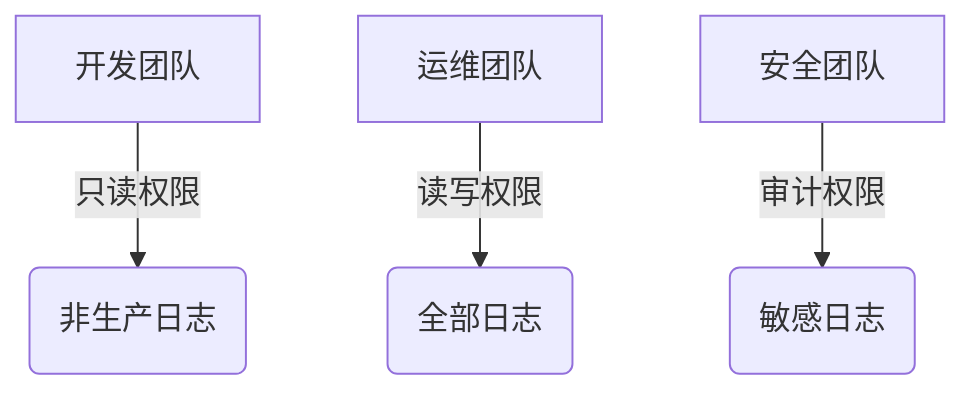

# 敏感信息处理

在日志管理系统中，敏感信息（如密码、API密钥、个人身份信息等）的保护至关重要。Grafana Loki作为日志聚合工具，需要特别注意这类数据的处理方式。本章将介绍如何通过配置、过滤和加密来保护敏感信息。

## 什么是敏感信息？

敏感信息是指一旦泄露可能导致安全风险的数据，例如：
- 用户凭证（用户名/密码）
- API密钥或令牌
- 信用卡号或个人身份信息（PII）
- 系统内部IP或主机名

:::warning
未处理的敏感信息可能导致数据泄露，甚至引发法律问题！
:::

## Loki 中的敏感信息处理策略

### 1. 日志脱敏（Redaction）

在日志摄入阶段过滤敏感内容，使用Loki的`pipeline_stages`配置：

```yaml
pipeline_stages:
  - regex:
      expression: '(password|api_key|token)=\\w+'
  - replace:
      replacement: '***REDACTED***'
```

**输入日志示例**：
```
user=admin password=secret123 api_key=abcd-1234
```

**输出结果**：
```
user=admin password=***REDACTED*** api_key=***REDACTED***
```

:::tip
正则表达式应根据业务需求定制，确保覆盖所有敏感字段模式。
:::

### 2. 访问控制

通过Grafana Loki的[RBAC](https://grafana.com/docs/loki/latest/operations/security/)实现权限管理：



### 3. 传输加密

确保所有数据传输使用TLS加密，Promtail配置示例：

```yaml
clients:
  - url: https://loki.example.com:3100/loki/api/v1/push
    tls_config:
      ca_file: /path/to/ca.pem
      cert_file: /path/to/cert.pem
      key_file: /path/to/key.pem
```

## 实际案例：电子商务平台

**场景**：支付服务日志可能包含信用卡信息

**解决方案**：
1. 在Promtail中配置脱敏规则：
```yaml
pipeline_stages:
  - regex:
      expression: 'card_number=\\d{16}'
  - replace:
      replacement: 'card_number=****-****-****-####'
```

2. 限制访问权限：
```sql
-- 在Grafana中配置数据源权限
GRANT QUERY ON payment_logs TO payment_team;
```

3. 存储加密：
```yaml
# Loki 存储配置
storage_config:
  boltdb_shipper:
    shared_store: s3
  s3:
    sse:
      type: KMS
```

## 总结

保护敏感信息需要多层次策略：
- **摄入阶段**：通过脱敏去除敏感内容
- **传输阶段**：使用TLS加密通信
- **存储阶段**：启用存储加密
- **访问阶段**：实施严格的RBAC控制

## 延伸学习

1. [Loki官方安全指南](https://grafana.com/docs/loki/latest/operations/security/)
2. 练习：为你的应用日志设计脱敏规则
3. 尝试配置Grafana的数据源权限

:::note
定期审计日志处理流程，确保符合最新的安全标准！
:::