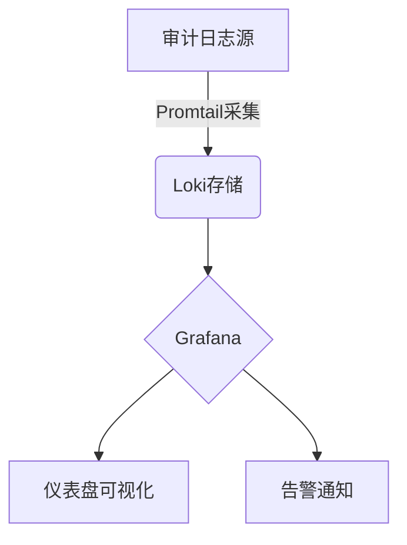

# 安全审计日志

## 简介

安全审计日志是记录系统关键操作（如用户登录、权限变更、数据访问等）的详细事件集合，用于监控异常行为、追溯安全事件和满足合规要求。在Grafana Loki中，通过高效存储和查询日志流，可以快速实现审计日志的集中管理。

:::tip 为什么需要审计日志？
- **安全分析**：检测潜在攻击或内部滥用行为<br />
- **合规性**：满足GDPR、ISO27001等法规要求<br />
- **故障排查**：定位系统异常的操作根源
:::

---

## 核心概念

### 1. 审计日志的关键字段
典型的审计日志应包含以下字段（以JSON格式为例）：
```json
{
  "timestamp": "2023-08-20T14:32:10Z",
  "user": "admin@example.com",
  "action": "delete_database",
  "resource": "production_db",
  "source_ip": "192.168.1.100",
  "status": "failed",
  "reason": "权限不足"
}
```

### 2. Loki中的存储优化
使用Loki标签提高查询效率：
```yaml
# promtail配置示例
scrape_configs:
  - job_name: audit_logs
    static_configs:
      - targets: [localhost]
        labels:
          job: audit
          env: production
          log_type: security
```

---

## 实战案例

### 场景：监控SSH登录失败
通过Loki日志告警规则检测暴力破解攻击：
```yaml
# alert.rules
groups:
  - name: security_alerts
    rules:
      - alert: SSHBruteForce
        expr: |
          sum by(source_ip) (
            rate({log_type="security"} |= "ssh" |~ "failed" [5m])
          ) > 3
        for: 10m
        annotations:
          summary: "SSH暴力破解攻击来自 {{ $labels.source_ip }}"
```

### 查询示例
在Grafana中使用LogQL分析可疑行为：
```sql
# 查询过去1小时的非工作时间登录
{log_type="security"} |= "login" 
| json 
| status="success" 
| timestamp > "2023-08-20T18:00:00Z" 
| timestamp < "2023-08-20T08:00:00Z"
```

---

## 可视化与告警



:::warning 注意事项
1. 确保日志包含足够上下文（如用户ID、操作对象）<br />
2. 敏感字段需脱敏处理（如密码、密钥）<br />
3. 设置合理的日志保留策略
:::

---

## 总结

通过Loki实现安全审计日志可以帮助您：
- 集中存储分散的审计事件
- 使用LogQL快速分析异常模式
- 结合Grafana实现实时监控

**延伸学习**：
- [Loki官方文档：安全最佳实践](https://grafana.com/docs/loki/latest/security/)
- 练习：配置一个监控文件删除操作的告警规则