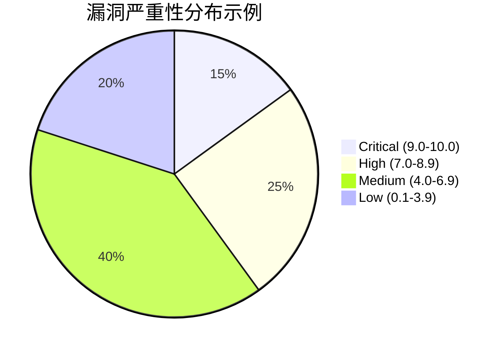

# 漏洞管理

## 简介

漏洞管理是识别、评估和修复系统中安全弱点的持续过程。在Grafana Loki这样的日志聚合系统中，漏洞可能出现在配置、依赖库或网络通信等环节。有效的漏洞管理能帮助您预防数据泄露和服务中断。

:::note 为什么重要？
Loki存储的日志可能包含敏感信息（如API密钥、用户数据）。未修复的漏洞可能成为攻击者的入口点。
:::

---

## 漏洞管理流程

### 1. 识别漏洞
- **工具扫描**：使用 `trivy` 或 `grype` 扫描Loki的容器镜像和依赖项。
  ```bash
  # 示例：扫描Loki Docker镜像
  trivy image grafana/loki:latest
  ```
  输出会列出CVE编号和严重等级（如`CRITICAL`或`HIGH`）。

- **监控公告**：订阅Grafana的安全公告邮件列表。

### 2. 评估风险
根据漏洞的CVSS评分（0-10分）和实际影响判断优先级：


### 3. 修复措施
- **补丁更新**：升级Loki版本
  ```bash
  helm upgrade loki grafana/loki --version 3.2.1
  ```
- **配置加固**：关闭调试接口
  ```yaml
  # loki-config.yaml
  auth_enabled: true
  admin_api:
    enabled: false  # 禁用管理API
  ```

---

## 实际案例

**案例：CVE-2022-31015（Loki API身份验证绕过）**
- **影响**：攻击者无需认证即可读取日志
- **修复方案**：
  1. 立即升级到Loki 2.6.1+
  2. 启用强制HTTPS
  ```yaml
  server:
    http_listen_port: 3100
    http_server_https_port: 443
  ```

:::warning 注意
即使漏洞已修复，仍需检查历史日志是否被泄露！
:::

---

## 总结

- 定期扫描Loki组件和依赖项
- 建立漏洞响应SOP（标准操作流程）
- 最小化权限原则：仅授予必要的访问权限

**延伸阅读**：
- [Grafana安全公告页](https://grafana.com/security/)
- OWASP漏洞管理指南
- NIST漏洞评分系统（CVSS）标准

**练习**：
1. 使用`trivy`扫描本地Loki实例
2. 模拟漏洞修复：降级到旧版本后应用补丁