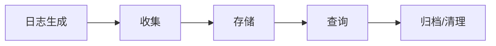

# 日志生命周期管理

日志生命周期管理（Log Lifecycle Management）是指从日志生成到最终归档或删除的全过程管理。在分布式系统中，有效的日志管理能帮助开发者快速定位问题、优化系统性能，同时控制存储成本。本章将介绍如何通过Grafana Loki实现这一流程。

## 为什么需要日志生命周期管理？

现代系统每天产生海量日志，若不加管理会导致：
- 存储成本飙升
- 查询效率下降
- 合规风险（如GDPR要求定期清理日志）

一个典型的日志生命周期包含四个阶段：
1. **收集**：从各个节点采集日志
2. **存储**：高效存储并建立索引
3. **查询**：快速检索关键信息
4. **归档/清理**：根据策略保留或删除



## Loki 中的日志生命周期实践

### 1. 日志收集配置

使用Promtail（Loki的日志收集代理）配置采集规则：

```yaml
# promtail-config.yaml
server:
  http_listen_port: 9080
  grpc_listen_port: 0

positions:
  filename: /tmp/positions.yaml

clients:
  - url: http://loki:3100/loki/api/v1/push

scrape_configs:
- job_name: system
  static_configs:
  - targets:
      - localhost
    labels:
      job: varlogs
      __path__: /var/log/*.log
```

:::tip
通过`__path__`可以使用通配符匹配多个日志文件，`labels`会附加到所有采集的日志中便于后续查询
:::

### 2. 存储策略配置

在Loki的配置文件中定义保留策略：

```yaml
# loki-config.yaml
auth_enabled: false

server:
  http_listen_port: 3100

common:
  storage:
    filesystem:
      chunks_directory: /loki/chunks
      rules_directory: /loki/rules
  replication_factor: 1

schema_config:
  configs:
    - from: 2020-10-24
      store: boltdb-shipper
      object_store: filesystem
      schema: v11
      index:
        prefix: index_
        period: 24h

compactor:
  working_directory: /loki/compactor
  shared_store: filesystem

limits_config:
  retention_period: 720h  # 30天自动删除
  retention_stream:
    - selector: '{job="varlogs"}'
      priority: 1
      period: 8760h  # 重要日志保留1年
```

关键参数说明：
- `retention_period`: 全局默认保留时间
- `retention_stream`: 为特定日志流设置特殊保留策略

### 3. 日志查询示例

使用LogQL查询最近1小时包含"error"的日志：

```bash
# 查询命令
curl -G http://localhost:3100/loki/api/v1/query_range \
  --data-urlencode 'query={job="varlogs"} |= "error"' \
  --data-urlencode 'limit=100' \
  --data-urlencode 'start=1h ago'
```

示例输出：
```json
{
  "status": "success",
  "data": {
    "resultType": "streams",
    "result": [
      {
        "stream": {
          "filename": "/var/log/app.log",
          "job": "varlogs"
        },
        "values": [
          ["1636543200000000000", "ERROR: Database connection failed"],
          ["1636543260000000000", "ERROR: Cache timeout"]
        ]
      }
    ]
  }
}
```

### 4. 日志归档实战

对于需要长期保留的日志，可以配置归档到对象存储（如S3）：

```yaml
# 添加对象存储配置
common:
  storage:
    s3:
      endpoint: minio:9000
      bucketnames: loki-archive
      access_key_id: ${ACCESS_KEY}
      secret_access_key: ${SECRET_KEY}
      s3forcepathstyle: true
```

## 实际案例：电商系统日志管理

**场景需求**：
- 支付相关日志保留3年（合规要求）
- 商品浏览日志保留7天
- 系统错误日志保留1个月

**解决方案**：
```yaml
limits_config:
  retention_stream:
    - selector: '{app="payment"}'
      period: 26280h  # 3年
    - selector: '{app="catalog"}'
      period: 168h    # 7天
    - selector: '{level="error"}'
      period: 720h   # 30天
```

## 总结与进阶

通过本章你已学会：
- 日志生命周期的四个关键阶段
- 使用Loki配置日志保留策略
- 针对不同业务需求设置差异化保留周期

**推荐练习**：
1. 在本地部署Loki和Promtail
2. 为不同类型日志设置不同的保留周期
3. 尝试查询特定时间范围内的归档日志

**扩展阅读**：
- [Loki官方文档：保留策略](https://grafana.com/docs/loki/latest/operations/storage/retention/)
- 《可观测性工程》第5章（日志管理最佳实践）