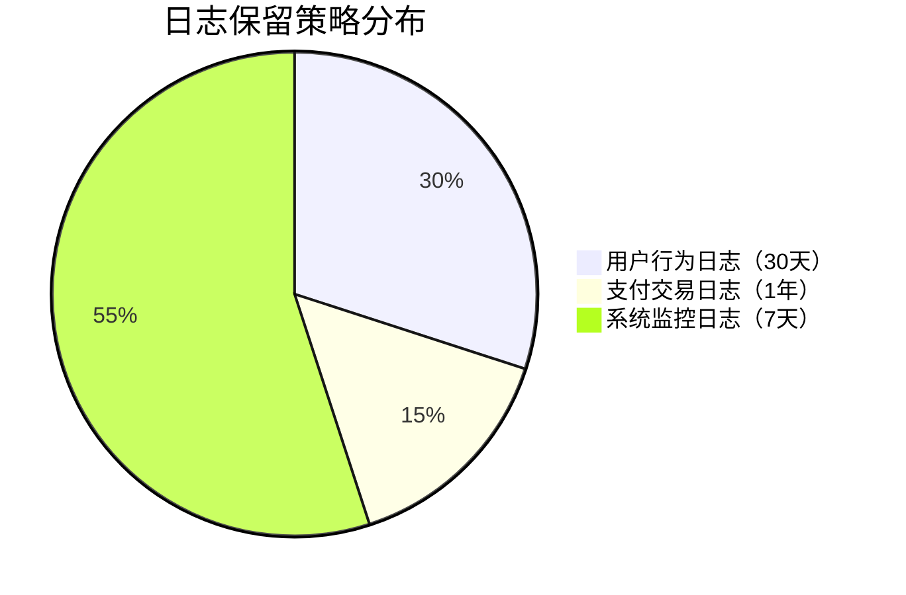

# 日志保留策略

日志保留策略是日志管理中的关键环节，它决定了日志数据的存储时长、存储方式以及过期后的处理机制。在Grafana Loki中，合理的日志保留策略能帮助您平衡存储成本与数据可用性。

## 为什么需要日志保留策略？

1. **存储成本控制**：日志数据会持续增长，长期存储所有日志可能导致高昂的存储成本。
2. **合规性要求**：某些行业规定要求日志必须保留特定时长（如金融行业通常要求6个月以上）。
3. **查询性能**：过多的历史日志会降低查询效率。

## Loki 中的保留策略机制

Loki通过两种主要方式实现日志保留：

### 1. 基于时间的保留

在Loki配置文件中设置全局保留期限（默认禁用）：

```yaml
limits_config:
  retention_period: 720h  # 保留30天（720小时）
  retention_stream:
    - selector: '{namespace="default"}'
      priority: 1
      period: 168h  # 该namespace保留7天
```

### 2. 基于存储容量的保留

Loki支持当存储达到阈值时自动清理旧日志：

```yaml
compactor:
  working_directory: /tmp/loki/compactor
  shared_store: filesystem
  retention_enabled: true
  retention_delete_delay: 2h
  retention_delete_worker_count: 10
```

## 配置示例

### 场景1：基本时间保留

```yaml
# loki-config.yaml
limits_config:
  retention_period: 720h  # 30天全局保留
```

应用配置后，超过30天的日志将自动删除。

### 场景2：细粒度保留规则

```yaml
# loki-config.yaml
limits_config:
  retention_period: 2160h  # 默认90天
  retention_stream:
    - selector: '{env="production"}'
      priority: 1
      period: 8760h  # 生产环境保留1年
    - selector: '{app="temp-service"}'
      priority: 2
      period: 24h    # 临时服务只保留1天
```

:::note 优先级说明
当多条规则匹配同一条日志时，`priority`值高的规则会覆盖低优先级的规则。
:::

## 保留策略的实际应用

### 案例：电商平台日志管理



配置实现：

```yaml
limits_config:
  retention_stream:
    - selector: '{log_type="user_activity"}'
      period: 720h
    - selector: '{log_type="payment"}'
      period: 8760h
    - selector: '{log_type="metrics"}'
      period: 168h
```

## 验证保留策略

1. 检查当前保留设置：

```bash
curl -G http://localhost:3100/loki/api/v1/rules
```

2. 手动触发保留操作：

```bash
loki -config.file=/etc/loki/config.yaml -target=compactor
```

## 高级技巧

:::tip 冷热存储分层
对于需要长期保留但很少查询的日志，可以配置存储分层：

```yaml
storage_config:
  boltdb_shipper:
    active_index_directory: /hot/storage
    shared_store: s3
  aws:
    s3: s3://cold-logs-bucket
```
:::

## 总结

关键要点：
- 根据日志价值和合规要求制定保留周期
- 生产环境日志通常比开发环境保留更久
- 使用`retention_stream`实现不同级别的保留策略
- 定期监控存储使用情况

## 延伸学习

建议练习：
1. 为你的测试环境配置7天日志保留
2. 创建一个优先级规则，使特定错误日志保留更长时间
3. 使用Loki API检查当前保留策略效果

附加资源：
- Loki官方文档：Retention功能章节
- Prometheus的保留策略（对比学习）
- 各行业日志保留合规标准参考