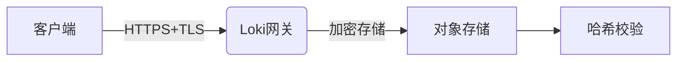

# 合规性日志管理

## 介绍

合规性日志管理是指按照行业标准或法规要求（如GDPR、HIPAA、PCI-DSS等）收集、存储和分析日志数据的过程。在Grafana Loki中，合规性日志管理通过高效的日志索引和查询能力，帮助组织证明其系统行为符合监管要求。

:::note 为什么需要合规性日志？
- **审计追踪**：记录谁在何时做了什么
- **安全分析**：检测和调查安全事件
- **法律合规**：满足数据保护法规要求
:::

## 核心概念

### 1. 日志保留策略

合规性通常要求日志保留特定时长（如6个月-7年）。Loki通过`compactor`和`retention`配置实现：

```yaml
# loki-config.yaml
compactor:
  working_directory: /tmp/loki/compactor
  shared_store: s3
  retention_enabled: true
  retention_delete_delay: 2h
  retention_delete_worker_count: 150

storage_config:
  aws:
    s3: s3://access-key:secret-key@region/bucket-name
```

### 2. 日志完整性保护

确保日志不被篡改：



### 3. 访问控制

通过Grafana Enterprise的RBAC功能限制日志访问：

```sql
-- 示例：仅允许审计团队访问财务日志
GRANT SELECT ON label='department=finance' TO ROLE audit_team;
```

## 实际操作示例

### 案例：PCI-DSS合规日志

**要求**：存储所有信用卡交易日志6个月，仅允许特定人员访问。

**解决方案**：

1. 配置Loki保留策略：
```yaml
limits_config:
  retention_period: 4380h  # 6个月
```

2. 创建专用日志标签：
```bash
# 日志采集时标记
- job_name: 'payment-service'
  relabel_configs:
    - target_label: compliance
      replacement: 'pci-dss'
```

3. 查询示例：
```logql
{compliance="pci-dss"} |= "credit_card"
```

## 常见合规框架支持

| 标准       | Loki功能对应                 | 配置要点                     |
|------------|-----------------------------|----------------------------|
| GDPR       | 日志匿名化                  | `pipeline_stages`中的掩码规则 |
| HIPAA      | 加密存储+访问日志           | 启用审计日志                |
| SOX        | 长期保留+完整性校验         | 对象存储+哈希链            |

## 总结

合规性日志管理是Loki在企业环境中的关键应用场景。通过：

1. 配置适当的保留策略
2. 实施严格的访问控制
3. 确保日志完整性和加密
4. 针对不同法规定制标签策略

## 延伸学习

- 练习：为你的Loki实例配置90天的日志保留策略
- 进阶：研究Loki的`audit.log`功能如何帮助合规
- 官方文档：[Loki Retention](https://grafana.com/docs/loki/latest/operations/storage/retention/)
