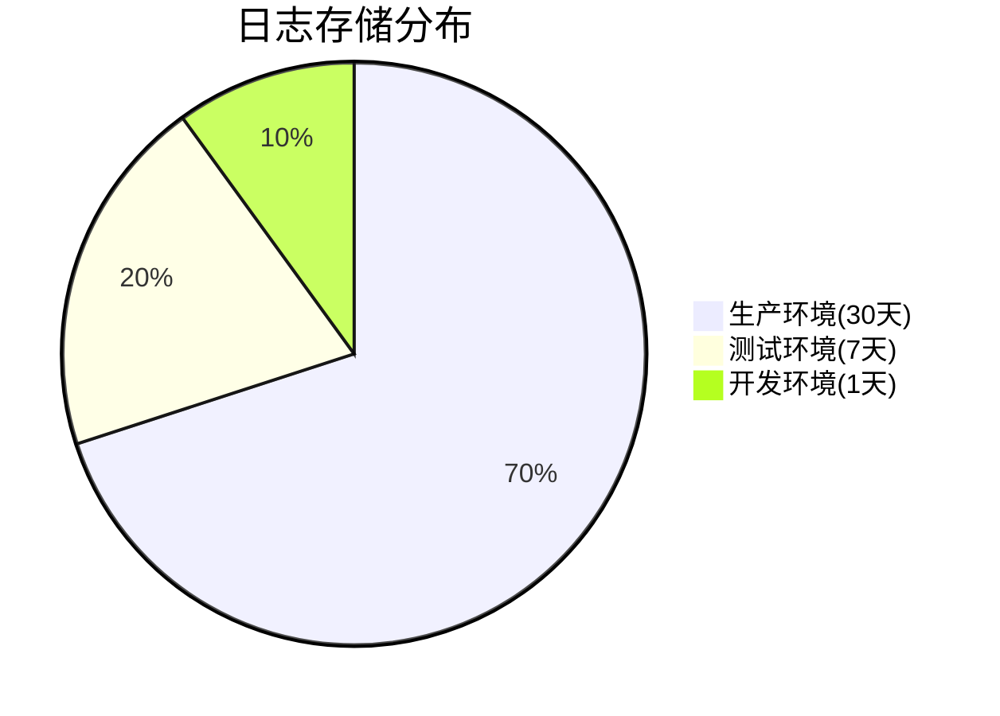

# 日志管理成本控制

## 介绍

日志管理是现代系统运维的核心任务之一，但随着系统规模扩大，日志数据量可能呈指数级增长，导致存储成本飙升、查询效率下降。Grafana Loki作为轻量级的日志聚合系统，通过独特的索引设计和压缩存储机制，能够显著降低日志管理成本。本章将介绍如何通过Loki实现高效的成本控制。

## 核心成本控制策略

### 1. 存储优化

Loki使用对象存储（如S3、GCS）保存日志数据，并通过以下方式降低存储开销：

```yaml
# loki-config.yaml 示例片段
storage_config:
  aws:
    s3: s3://your-bucket
    region: us-east-1
  boltdb_shipper:
    shared_store: s3
```

:::tip 存储压缩
Loki默认使用gzip压缩日志，压缩率可达5-10倍。可通过以下配置调整：
```yaml
chunk_store_config:
  chunk_cache_config:
    enable_fifocache: true
    fifocache:
      size: 500MB
```
:::

### 2. 保留策略

通过时间或空间限制自动清理旧日志：

```yaml
# 保留30天日志
table_manager:
  retention_deletes_enabled: true
  retention_period: 720h
```



### 3. 日志采集过滤

在Promtail中过滤无关日志：

```yaml
# promtail-config.yaml 示例
scrape_configs:
  - job_name: system
    pipeline_stages:
      - drop:
          expression: ".*debug.*"
```

## 实际案例：电商平台优化

**场景**：某电商平台每日产生2TB日志，存储成本每月$3000

**优化措施**：
1. 过滤调试日志（减少40%数据量）
2. 调整保留策略（生产30天→15天）
3. 启用压缩（存储占用减少60%）

**结果**：
- 月存储成本降至$800
- 查询性能提升3倍

## 高级技巧

### 动态日志级别

```go
// 应用代码示例：动态调整日志级别
if currentHour > 22 || currentHour < 6 {
    logger.SetLevel(logrus.WarnLevel) // 夜间只记录警告
} else {
    logger.SetLevel(logrus.InfoLevel)
}
```

### 多租户隔离

```yaml
# 为不同团队分配配额
limits_config:
  ingestion_rate_mb: 10
  ingestion_burst_size_mb: 20
  max_streams_per_user: 10000
```

## 总结

关键成本控制方法：
1. 合理设置日志保留周期
2. 在采集阶段过滤无用日志
3. 利用压缩和高效存储格式
4. 实施多租户资源配额

## 延伸学习

推荐练习：
1. 在测试环境模拟不同保留策略的效果
2. 比较gzip/zstd压缩算法的性能差异
3. 使用`logcli`分析日志存储模式

附加资源：
- Loki官方文档《Storage Optimization》
- CNCF白皮书《云原生日志管理最佳实践》