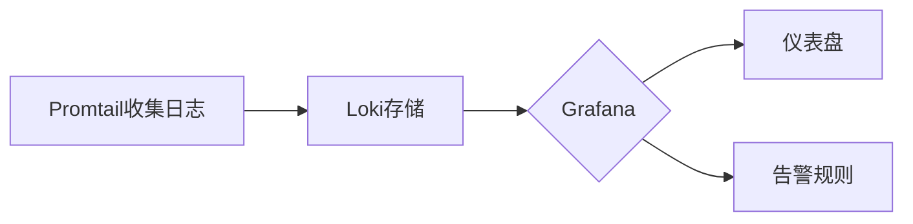

## 引言

日志是系统运行状态的重要记录，有效的日志管理能帮助开发者快速定位问题、优化性能并满足合规性要求。Grafana Loki是一个轻量级的日志聚合系统，专注于低成本和高效率的日志存储与查询。本章将介绍日志管理的核心原则，并结合Loki的实际操作演示最佳实践。

---

## 1. 日志管理基础

### 什么是日志管理？
日志管理包括日志的**收集**、**存储**、**索引**、**查询**和**分析**。核心目标是：
- **可观测性**：实时监控系统状态
- **故障排查**：快速定位问题根源
- **合规性**：满足审计和安全要求

:::tip Loki的优势
Loki通过仅索引元数据（如标签）而非日志内容，大幅降低存储成本，同时支持类PromQL的查询语法（LogQL）。
:::

---

## 2. 最佳实践详解

### 实践1：结构化日志
使用JSON等结构化格式记录日志，便于解析和过滤。

**示例代码（Node.js应用）**：
```javascript
const winston = require('winston');
const logger = winston.createLogger({
  format: winston.format.json(),
  transports: [new winston.transports.Console()]
});

logger.info('User login', { 
  userId: 'u123', 
  ip: '192.168.1.1',
  timestamp: new Date().toISOString()
});
```

**输出结果**：
```json
{
  "level": "info",
  "message": "User login",
  "userId": "u123",
  "ip": "192.168.1.1",
  "timestamp": "2023-08-20T09:30:00Z"
}
```

### 实践2：合理的标签策略
Loki通过标签（labels）加速查询，但需避免高基数问题（如用户ID不宜直接作为标签）。

**推荐标签示例**：
```yaml
# promtail配置片段
scrape_configs:
  - job_name: myapp
    static_configs:
      - targets: [localhost]
        labels:
          job: 'myapp-backend'
          env: 'production'
          severity: ('error' | 'warn' | 'info') # 有限枚举值
```

### 实践3：日志保留策略
根据需求设置保留周期（如生产环境保留30天）：
```yaml
# loki-config.yaml
compactor:
  retention_enabled: true
  retention_delete_delay: 2h
  retention_delete_worker_count: 10

storage_config:
  boltdb_shipper:
    shared_store: s3
  retention_period: 720h # 30天
```

---

## 3. 实际案例：电商系统故障排查

### 场景描述
用户投诉支付失败，需通过日志快速定位问题。

**LogQL查询示例**：
```sql
{job="payment-service", env="production"} 
  |="ERROR" 
  | json 
  | statusCode=500 
  | line_format "{{.traceID}} {{.errMsg}}"
```

**分析步骤**：
1. 过滤`payment-service`的ERROR日志
2. 解析JSON字段
3. 筛选HTTP 500错误
4. 提取追踪ID和错误信息

---

## 4. 可视化与告警

### 通过Grafana展示日志


**告警规则示例**：
```yaml
# loki-rules.yaml
groups:
  - name: critical-errors
    rules:
      - alert: HighErrorRate
        expr: |
          sum(rate({job=~".+"} |="ERROR" [5m])) by (job)
            / 
          sum(rate({job=~".+"}[5m])) by (job) > 0.05
        for: 10m
        labels:
          severity: 'critical'
```

---

## 总结

关键实践回顾：
1. **结构化日志**提升可读性
2. **谨慎使用标签**避免高基数
3. **设置保留策略**平衡成本与需求
4. **结合LogQL**高效查询
5. **可视化+告警**实现主动监控

---

## 扩展练习
1. 在本地部署Loki和Promtail，收集Nginx访问日志
2. 创建一个Grafana仪表盘，显示每小时请求量TOP 5的URL
3. 设置当5xx错误率超过1%时触发告警

:::note 更多资源
- [Loki官方文档](https://grafana.com/docs/loki/latest/)
- 《可观测性工程》书籍（O'Reilly）
:::