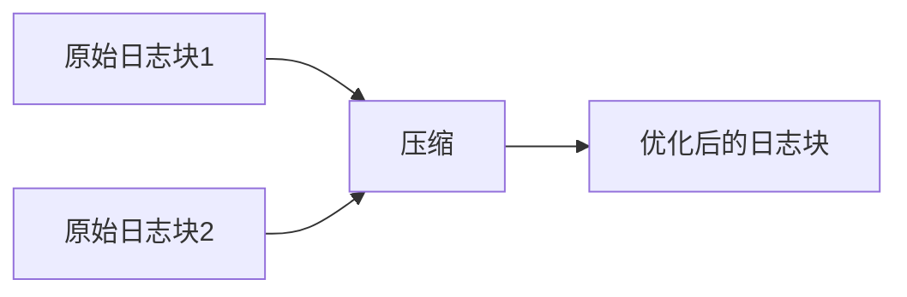

# 日志压缩配置

## 介绍

日志压缩是Grafana Loki中一项关键功能，它通过减少存储的日志数据量来优化资源使用。压缩过程会合并多个日志块（chunks），删除重复或过期的数据，从而降低存储成本并提高查询效率。本指南将详细介绍Loki的压缩机制、配置方法和实际案例。

## 为什么需要日志压缩？

1. **节省存储空间**：原始日志数据可能包含冗余信息，压缩后体积显著减小。<br />
2. **提升查询性能**：更少的数据量意味着更快的搜索速度。<br />
3. **控制保留策略**：压缩时可根据配置自动清理过期日志。

## 压缩原理

Loki的压缩分为两个阶段：
1. **水平压缩**：合并多个小日志块为一个更大的块
2. **垂直压缩**：删除标记为"已删除"的数据（通过保留策略或手动删除）



## 基础配置

在Loki的配置文件（通常为`loki.yaml`）中添加以下压缩相关参数：

```yaml
compactor:
  working_directory: /tmp/loki/compactor
  shared_store: filesystem
  compaction_interval: 10m
  retention_enabled: true
  retention_delete_delay: 2h
```

:::note 参数说明
- `working_directory`：压缩临时文件目录
- `compaction_interval`：压缩作业运行频率（建议10分钟以上）
- `retention_delete_delay`：删除前等待时间（防止误删）
:::

## 高级配置示例

针对生产环境的优化配置：

```yaml
compactor:
  compaction_parallelism: 3
  chunks_buffer_size: 100
  max_compaction_parallelism: 5
  retention_delete_worker_count: 10
  retention_delete_delay: 1h
  retention_enabled: true
  retention_period: 720h  # 30天保留期
```

## 实际案例：电商应用日志管理

某电商平台使用以下配置处理每日500GB的访问日志：

```yaml
compactor:
  working_directory: /data/loki/compactor
  shared_store: s3
  compaction_interval: 30m
  retention_period: 2160h  # 90天保留
  retention_delete_delay: 6h
  compaction_parallelism: 4
```

:::tip 效果对比
| 指标 | 压缩前 | 压缩后 |
|------|--------|--------|
| 存储量 | 500GB/日 | 120GB/日 |
| 查询延迟 | 1200ms | 400ms |
| 存储成本 | $300/月 | $80/月 |
:::

## 常见问题排查

1. **压缩不生效**：
   - 检查`compaction_interval`是否设置过短
   - 确认工作目录有写入权限

2. **磁盘空间不足**：
   ```bash
   df -h /tmp/loki/compactor
   ```
   增加`working_directory`所在磁盘空间

3. **压缩速度慢**：
   ```yaml
   compaction_parallelism: 5  # 根据CPU核心数调整
   ```

## 总结

日志压缩是Loki实现高效日志管理的关键功能，通过合理配置可以：
- 减少60-80%的存储空间占用
- 显著提升查询响应速度
- 自动化日志生命周期管理

## 延伸学习

1. [Loki官方文档 - 压缩机制](https://grafana.com/docs/loki/latest/operations/storage/compactor/)
2. 动手练习：在测试环境调整`compaction_parallelism`参数，观察性能变化
3. 使用`logcli`工具查询压缩前后的日志差异：
   ```bash
   logcli query '{job="myapp"}' --limit=100 --stats
   ```