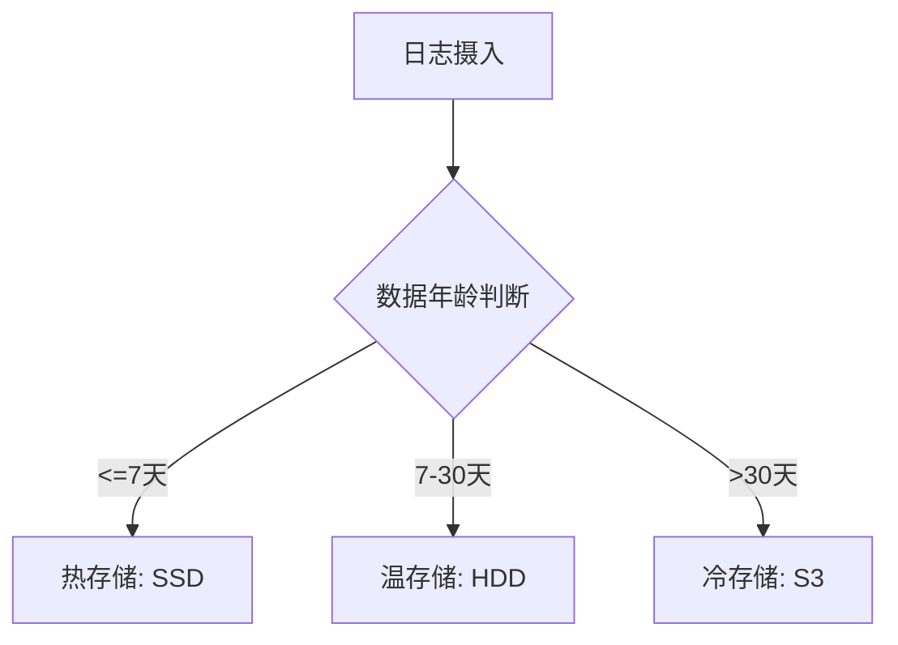

# 日志归档方案

## 介绍

日志归档是将不再频繁访问但仍需保留的日志数据转移到低成本存储系统的过程。在Grafana Loki中，通过合理的归档策略可以：
- 降低存储成本
- 满足合规性要求
- 保持历史数据的可查询性

:::note 关键概念
Loki采用**冷热数据分层**架构：
- **热数据**：近期高频访问的日志，存储在快速但昂贵的存储中
- **冷数据**：历史低频访问的日志，存储在慢速但廉价的存储中
:::

## 核心归档方案

### 1. 存储配置分层

在Loki的配置文件(`loki.yaml`)中定义多级存储：

```yaml
storage_config:
  boltdb_shipper:
    active_index_directory: /loki/index
    cache_location: /loki/boltdb-cache
  aws:
    s3: s3://loki-archives
    s3forcepathstyle: true
```

### 2. 保留策略设置

通过`compactor`配置数据保留周期：

```yaml
compactor:
  working_directory: /loki/compactor
  shared_store: s3
  retention_enabled: true
  retention_delete_delay: 2h
  retention_delete_worker_count: 10
```

### 3. 数据生命周期管理

使用`table_manager`控制日志表(TSDB)的保留：

```yaml
table_manager:
  retention_deletes_enabled: true
  retention_period: 720h # 30天热数据保留
  chunk_retain_period: 15m
```

## 实际案例：电商系统日志归档

### 场景需求
- 近7天日志：实时查询，毫秒级响应
- 7-30天日志：允许秒级延迟查询
- 30天以上：归档到对象存储，允许分钟级查询

### 配置实现

```yaml
schema_config:
  configs:
    - from: 2023-01-01
      store: boltdb-shipper
      object_store: aws
      schema: v12
      index:
        prefix: index_
        period: 24h
      chunks:
        prefix: chunk_
        period: 24h

storage_config:
  aws:
    s3: s3://loki-archive-prod
    bucketnames: "hot:7d|cold:30d|archive:1y"
```



## 查询归档数据

Loki自动处理存储分层，使用相同LogQL语法查询所有数据：

```bash
# 查询所有存储层的数据
logcli query '{job="payment-service"}' --since=720h
```

:::tip 性能优化
添加`--query-store=hot|cold|archive`参数可限定查询范围加速响应
:::

## 总结

关键要点：
1. 通过存储分层平衡成本与性能
2. 保留策略应匹配业务需求
3. 归档数据保持可查询性

## 扩展练习

1. 在本地Loki实例中配置双级存储(本地SSD+S3)
2. 使用`logcli`比较不同时间范围查询的响应时间差异
3. 编写一个自动归档脚本，将特定标签的日志移动到冷存储

## 附加资源

- [Loki官方存储文档](https://grafana.com/docs/loki/latest/storage/)
- [S3兼容存储配置指南](https://grafana.com/docs/loki/latest/storage/aws/)
- [保留策略最佳实践](https://grafana.com/blog/2022/03/15/how-to-optimize-loki-log-retention-for-reducing-operational-overhead/)