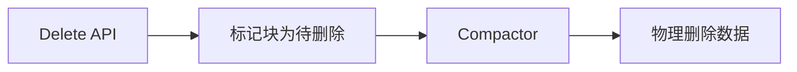

# 日志删除机制

日志管理是分布式系统可观测性的核心部分，而日志删除机制则是确保存储效率和数据合规性的关键。在 Grafana Loki 中，日志删除机制允许用户根据需求清理旧日志，避免存储空间无限增长。本文将介绍 Loki 的日志删除实现方式，包括自动保留策略和手动删除操作。

## 介绍

Grafana Loki 是一个水平可扩展、高可用的多租户日志聚合系统，专为效率而设计。与其他日志系统不同，Loki 不会索引日志内容，而是通过标签（labels）进行索引。这种设计使其存储成本更低，但也意味着日志删除机制需要特别处理。

日志删除在以下场景中尤为重要：
- 遵守数据保留政策（如 GDPR）
- 控制存储成本
- 清理测试或临时数据

## 保留策略

Loki 支持基于时间的保留策略，可以全局配置或在租户级别覆盖。保留策略决定了日志在 Loki 中保存的时长。

### 配置全局保留

在 Loki 的配置文件 `loki.yaml` 中，可以通过以下方式设置全局保留期：

```yaml
table_manager:
  retention_deletes_enabled: true
  retention_period: 720h  # 保留30天（30 * 24小时）
```

:::note
保留期以持续时间字符串表示，支持的单位包括 `h`（小时）、`d`（天）、`w`（周）。
:::

### 租户级保留

对于多租户部署，可以通过 Compactor 配置覆盖特定租户的保留设置：

```yaml
compactor:
  override_retention_period:
    "tenant-1": 168h  # tenant-1 保留7天
    "tenant-2": 720h  # tenant-2 保留30天
```

## 手动删除日志

除了自动保留外，Loki 还提供了 API 用于手动删除日志。

### 按时间范围删除

使用 Loki 的 `delete` API 可以删除特定时间范围内的日志：

```bash
curl -X POST \
  -H "X-Scope-OrgID: tenant-1" \
  -H "Content-Type: application/json" \
  -d '{
    "query": "{job=\"my-service\"}",
    "start": "2023-01-01T00:00:00Z",
    "end": "2023-01-31T23:59:59Z"
  }' \
  http://localhost:3100/loki/api/v1/delete
```

:::caution
删除操作是异步的，可能需要一段时间才能反映在查询结果中。
:::

### 按标签删除

Loki 2.8+ 支持通过日志流选择器删除特定标签的日志：

```bash
curl -X DELETE \
  -H "X-Scope-OrgID: tenant-1" \
  "http://localhost:3100/loki/api/v1/delete?query={job=\"my-service\",env=\"dev\"}"
```

## 实际案例

### 案例1：合规性数据清理

某金融应用需要遵守监管要求，将日志保留期设为1年。配置如下：

```yaml
table_manager:
  retention_deletes_enabled: true
  retention_period: 8760h  # 365天
```

### 案例2：开发环境每日清理

开发环境日志只需保留7天，且每天凌晨清理测试数据：

```bash
# 每日清理超过7天的dev环境日志
curl -X DELETE \
  -H "X-Scope-OrgID: dev-team" \
  "http://loki:3100/loki/api/v1/delete?query={env=\"dev\"}&end=$(date -d '7 days ago' +%s)000000000"
```

## 内部机制

Loki 的删除操作通过以下组件协作完成：



1. **标记阶段**：将符合条件的数据块标记为待删除
2. **压缩阶段**：Compactor 定期运行，实际移除被标记的数据
3. **存储清理**：后端存储（如S3、GCS）中的对象最终被删除

## 总结

Loki 提供了灵活的日志删除机制：
- 通过保留策略自动清理旧数据
- 支持精确的手动删除（按时间或标签）
- 多租户场景下可定制保留期

## 延伸学习

- 练习：配置一个保留策略，自动删除超过14天的日志
- 进阶：使用 Loki 的 `metrics` API 监控删除操作的状态
- 官方文档：[Loki Retention](https://grafana.com/docs/loki/latest/operations/storage/retention/)