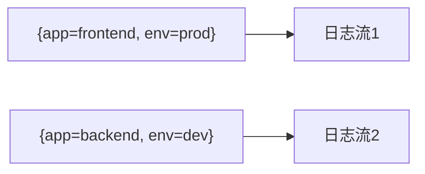

# 数据标签管理

## 介绍

在Grafana Loki中，**数据标签（Labels）**是日志数据的元数据标识符，用于快速过滤和查询日志流。与Prometheus类似，Loki通过键值对（如 `app=frontend`）标记日志，但设计上更注重低成本和高效率。标签的选择直接影响查询性能和存储效率，因此需要谨慎设计。

:::tip 核心原则
Loki的标签应满足：**高基数避免**（如避免`user_id`作为标签）和**业务相关性**（如`env=prod`）。
:::

---

## 标签基础

### 1. 标签的结构
标签是键值对，例如：
```yaml
{job="nginx", env="production"}
```
- `job`: 日志来源（如服务名）
- `env`: 部署环境（如生产/测试）

### 2. 标签与日志流的关系
每个唯一的标签组合定义一个**日志流**。例如：


---

## 实际操作

### 1. 定义标签（Promtail配置）
在日志采集端（如Promtail）的 `scrape_configs` 中定义标签：
```yaml
scrape_configs:
  - job_name: nginx
    static_configs:
      - targets: [localhost]
        labels:
          job: nginx
          env: production
          __path__: /var/log/nginx/*.log
```

### 2. 查询时使用标签
在LogQL中通过标签过滤日志：
```sql
{job="nginx", env="production"} |= "error"
```
输出结果仅包含`nginx`生产环境中含`error`的日志。

---

## 真实案例

### 场景：电商微服务日志管理
假设有以下服务：
- `user-service`（环境：prod/dev）
- `order-service`（环境：prod/dev）

**标签设计**：
```yaml
# user-service的Promtail配置
labels:
  app: user-service
  env: prod
  team: ecommerce
```

**查询示例**：
```sql
# 查询生产环境所有服务的错误日志
{env="prod"} |= "error" 
# 查询user-service的特定请求ID
{app="user-service"} |= "request_id=12345"
```

---

## 常见问题

:::caution 标签基数爆炸
错误示例：将高基数字段（如`request_id`）设为标签会导致存储压力剧增。<br />
解决方案：改用过滤器查询：
```sql
{app="frontend"} |= "request_id=12345"
```
:::

---

## 总结

1. **标签作用**：加速查询，组织日志流。
2. **最佳实践**：
   - 使用有限且稳定的标签（如`env`, `app`）。
   - 避免高基数标签。
3. **工具链**：通过Promtail配置标签，LogQL查询日志。

---

## 延伸练习

1. 在本地Loki中配置一个标签 `version="v1"`，并查询该版本日志。
2. 对比查询性能：使用标签 `{app="nginx"}` vs 全文搜索 `|= "nginx"`。

:::note 附加资源
- [官方标签文档](https://grafana.com/docs/loki/latest/fundamentals/labels/)
- [LogQL教程视频](https://example.com)
:::