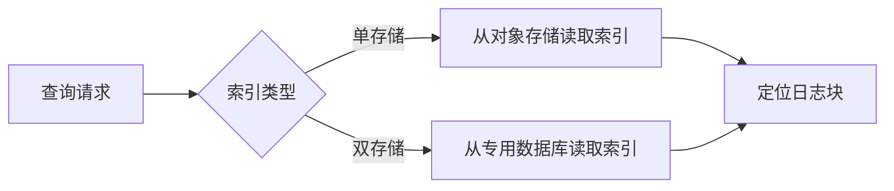

# 索引管理

## 介绍

索引是Grafana Loki中用于快速定位日志数据的关键组件。它类似于书籍的目录，帮助系统快速找到特定日志内容，而无需扫描全部数据。良好的索引管理能显著提升查询效率，同时控制存储开销。

:::note Loki索引的特点
- 基于标签（Label）而非内容建立索引
- 采用倒排索引结构优化标签搜索
- 索引与日志数据分离存储
:::

## 索引基础

### 索引类型

Loki支持两种索引存储后端：

1. **单存储（Single Store）**：索引和块数据统一存储（如S3/GCS）
2. **双存储（Separate Store）**：索引（通常用DynamoDB/Cassandra）与块数据分离



### 标签索引原理

Loki通过以下流程建立标签索引：

1. 提取日志流的标签组合（如`{job="api", env="prod"}`）
2. 为每个唯一标签组合创建索引条目
3. 映射到对应的日志块存储位置

## 索引配置

### 基础配置示例

在Loki配置文件（`loki.yaml`）中定义索引：

```yaml
schema_config:
  configs:
    - from: 2023-01-01
      store: boltdb-shipper
      object_store: s3
      schema: v11
      index:
        prefix: loki_index_
        period: 24h
```

关键参数说明：
- `period`：索引分片的时间间隔（更短=查询更快但成本更高）
- `prefix`：索引对象的前缀命名空间

### 索引分片策略

通过时间分片优化大型部署：

```yaml
storage_config:
  boltdb_shipper:
    active_index_directory: /loki/index
    shared_store: s3
    resync_interval: 5m
```

:::tip 分片建议
- 高频日志：使用更短的分片周期（如1h）
- 低频日志：可延长至24h或更长
:::

## 实际操作

### 查询索引状态

使用LogCLI检查索引：

```bash
logcli query --stats '{job="nginx"}' --limit=0
```

输出示例：
```json
{
  "status": "success",
  "data": {
    "stats": {
      "index": {
        "totalChunks": 42,
        "postFilterChunks": 18,
        "shards": 3
      }
    }
  }
}
```

### 索引维护操作

1. **强制压缩索引**：
```bash
loki-admin index-cleanup --config.file=loki.yaml --compact
```

2. **查看索引列表**：
```bash
aws s3 ls s3://your-bucket/loki_index_ --recursive | grep index.gz
```

## 性能优化

### 索引缓存配置

```yaml
query_range:
  cache_results: true
  results_cache:
    cache:
      enable_fifocache: true
      fifocache:
        size: 1024
        validity: 1h
```

### 标签优化策略

避免高基数标签：
```go
// 错误示例 - 会导致索引爆炸
labels := []string{"request_id", uuid.New().String()}

// 正确示例 - 使用有限值标签
labels := []string{"http_status", "200"}
```

## 实际案例

### 电商平台日志优化

**问题**：
- 每日20TB日志
- 查询延迟超过30秒

**解决方案**：
1. 将索引分片从24h改为4h
2. 为高频查询标签（`user_type`、`region`）建立缓存
3. 清理无价值标签（如随机生成的跟踪ID）

**结果**：
- P99查询延迟降至1.2秒
- 索引存储成本降低40%

## 总结

关键要点：
- 索引设计直接影响查询性能和存储效率
- 通过分片和缓存平衡速度与成本
- 避免高基数标签是优化核心

## 延伸学习

推荐练习：
1. 使用不同分片周期测试查询性能
2. 对比单存储与双存储的性能差异
3. 模拟高基数标签场景观察系统行为

官方资源：
- [Loki存储架构文档](https://grafana.com/docs/loki/latest/storage/)
- [索引性能调优指南](https://grafana.com/docs/loki/latest/operations/storage/retention/)