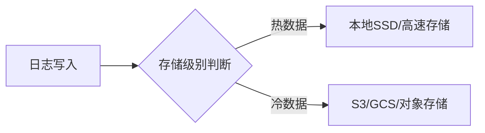

# 日志存储级别

## 介绍

在日志管理系统中，**日志存储级别**（Log Storage Tiers）是指根据数据的访问频率和重要性，将日志存储在不同性能或成本的存储介质上的策略。Grafana Loki 通过分层存储设计，允许用户将**热数据**（频繁访问）保留在高速存储（如 SSD），而将**冷数据**（较少访问）归档到低成本存储（如对象存储）。

这种设计平衡了查询性能与存储成本，尤其适合大规模日志系统。下面我们将逐步解析 Loki 的存储级别机制。

---

## 核心概念

### 1. 存储层级划分
Loki 的存储级别通常分为两类：
- **热存储（Hot Tier）**：存储近期日志，支持快速查询。
- **冷存储（Cold Tier）**：存储历史日志，查询延迟较高但成本低。



### 2. 数据生命周期
Loki 通过 `compactor` 组件自动将热数据迁移到冷存储。迁移策略由以下配置控制：
- `retention_period`: 热数据的保留时长（如 `7d`）。
- `compaction_interval`: 压缩和迁移任务的执行频率。

---

## 配置示例

### 1. 定义存储级别
在 Loki 的配置文件（`loki.yaml`）中指定存储后端：

```yaml
storage_config:
  boltdb_shipper:
    active_index_directory: /loki/hot/index
    shared_store: s3
  aws:
    s3: s3://loki-cold-storage
    region: us-east-1
```

### 2. 设置保留策略
通过 `table_manager` 控制数据保留：

```yaml
table_manager:
  retention_deletes_enabled: true
  retention_period: 720h # 热存储保留30天
```

---

## 实际案例

### 场景：电商平台日志管理
一家电商平台需要：
- **实时监控**：最近 2 天的订单日志（热存储，快速查询）。
- **合规审计**：6 个月内的历史日志（冷存储，低成本）。

配置如下：
```yaml
storage_config:
  boltdb_shipper:
    shared_store: s3
  aws:
    s3: s3://audit-logs
schema_config:
  configs:
    - from: 2023-01-01
      store: boltdb-shipper
      object_store: aws
      schema: v11
      index:
        prefix: loki_index_
        period: 24h
```

---

## 总结

日志存储级别是 Loki 实现高效日志管理的核心特性，通过分层存储：
- **降低成本**：冷数据使用对象存储。
- **保持性能**：热数据快速响应查询。

:::tip 练习
1. 尝试在本地 Loki 实例中配置热/冷存储，并验证日志迁移效果。
2. 使用 `logcli` 查询冷热数据，观察响应时间差异。
:::

### 扩展阅读
- [Loki 官方文档：存储架构](https://grafana.com/docs/loki/latest/storage/)
- 《云原生日志系统设计》第三章